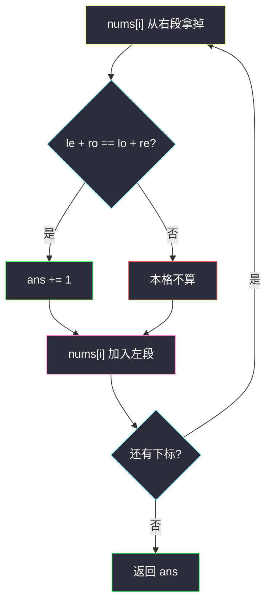
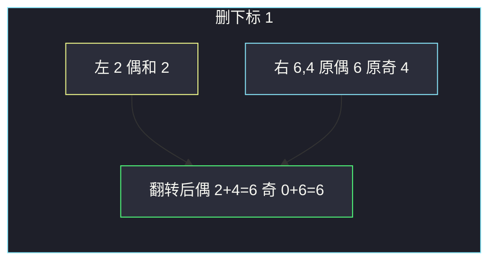

# 生成平衡数组的方案数（前后缀 · 删一后奇偶翻转）

## 一、问题描述

下标从 0 开始。若数组里**偶数下标**上的元素之和等于**奇数下标**上的元素之和，称它是平衡的。你可以删掉**恰好一个**下标（删后右边元素下标全部减 1，奇偶翻转）。问有多少种删法，使剩下的数组平衡。

> 🔗 LeetCode 1664：https://leetcode.cn/problems/ways-to-make-a-fair-array/
>
> 数据范围：`1 ≤ n ≤ 10^5`，`1 ≤ nums[i] ≤ 10^4`。
>
> 📚 灵茶题单：**专题：前后缀分解**。枚举删的是 `i`：左边下标不变，右边整体奇偶翻转。维护左偶/左奇和与右偶/右奇和，每个 `i` 用 `O(1)` 判定。

**示例 1**

```
输入：nums = [2,1,6,4]
输出：1
解释：删下标 1，剩下 [2,6,4]，偶下标和 2+4=6，奇下标和 6，相等。
```

**示例 2**

```
输入：nums = [1,1,1]
输出：3
解释：删任意一个，剩下两个 1，一个偶数下标一个奇数下标，平衡。
```

**示例 3**

```
输入：nums = [1,2,3]
输出：0
```

**直观理解**

删掉 `i` 以后，`0..i-1` 的奇偶和原来一样；`i+1..n-1` 里原来的偶数下标变成奇数，原来的奇数下标变成偶数。所以新的偶下标和 = 左偶 + 右奇，新的奇下标和 = 左奇 + 右偶。

---

## 二、暴力解法

对每个删除位置，真的构造剩下的数组再求和。

```python
class Solution:
    def waysToMakeFair(self, nums: list[int]) -> int:
        n = len(nums)
        ans = 0
        for i in range(n):
            even = odd = 0
            idx = 0
            for j in range(n):
                if j == i:
                    continue
                if idx % 2 == 0:
                    even += nums[j]
                else:
                    odd += nums[j]
                idx += 1
            if even == odd:
                ans += 1
        return ans
```

官方三例都能过。时间 `O(n²)`，`n=10^5` 超时。

### 🔴 瓶颈在哪里

相邻两次删除，左右两端信息几乎一样，只差一个被删元素和一段奇偶翻转。用滚动的左和、右和，每个 `i` 摊到 `O(1)`。

---

## 三、优化探索（核心章节）

> 📚 本题在灵茶题单中属于 **专题：前后缀分解**。分割点是「被删的 i」：左段原奇偶，右段翻转奇偶。先把整段的偶/奇和当作「当前右段」，扫到 `i` 时先从右边拿掉 `nums[i]`，判定后再把它交给左边。

### 3.1 删 i 之后的两个和

记：

- `le, lo`：`nums[0..i-1]` 里偶数下标和、奇数下标和（原下标）；
- `re, ro`：`nums[i+1..n-1]` 里偶数下标和、奇数下标和（原下标）。

删 `i` 后：

- 新偶和 = `le + ro`（右边原来的奇数下标，新下标减 1 变偶数）；
- 新奇和 = `lo + re`。

平衡 ⇔ `le + ro == lo + re`。

### 3.2 滚动维护

先一遍算出整个数组的 `re, ro`（这时右段暂且是全体）。`i` 从 0 到 `n-1`：

1. 把 `nums[i]` 从右段去掉（它现在是「正被删的」）；
2. 用当前 `le, lo, re, ro` 判定；
3. 把 `nums[i]` 加进左段（下一轮它属于左边）。

不必开后缀数组。若更想「预处理味」，可先做 `suffix_even[i]`、`suffix_odd[i]` 表示 `nums[i..]` 的偶/奇和，再扫 `i`。



### 3.3 一句话核心

> **删 i 后右边下标奇偶翻转：新偶和 = 左偶 + 右奇，新奇和 = 左奇 + 右偶；滚动左右四元组和即可。**

---

## 四、代码实现

### Python（主解）

```python
class Solution:
    def waysToMakeFair(self, nums: list[int]) -> int:
        n = len(nums)
        # re / ro: 当前右段（含尚未处理的 i）原偶 / 奇下标和
        re = ro = 0
        for i, x in enumerate(nums):
            if i % 2 == 0:
                re += x
            else:
                ro += x
        le = lo = 0  # 左段原偶 / 奇下标和
        ans = 0
        for i, x in enumerate(nums):
            if i % 2 == 0:
                re -= x
            else:
                ro -= x
            # 删 i 后：新偶 = le+ro，新奇 = lo+re
            if le + ro == lo + re:
                ans += 1
            if i % 2 == 0:
                le += x
            else:
                lo += x
        return ans
```

**变量含义**

| 写法 | 含义 |
|------|------|
| `le, lo` | 左段原偶下标和、原奇下标和 |
| `re, ro` | 右段原偶下标和、原奇下标和 |
| `le + ro` | 删除后的新偶数下标和 |
| `lo + re` | 删除后的新奇数下标和 |

`n=1`：删掉唯一元素，空数组偶奇和都是 0，算 1 种。循环会判定一次 `0==0`。

### Java（最优解）

```java
class Solution {
    public int waysToMakeFair(int[] nums) {
        int re = 0, ro = 0;
        for (int i = 0; i < nums.length; i++) {
            if (i % 2 == 0) {
                re += nums[i];
            } else {
                ro += nums[i];
            }
        }
        int le = 0, lo = 0, ans = 0;
        for (int i = 0; i < nums.length; i++) {
            if (i % 2 == 0) {
                re -= nums[i];
            } else {
                ro -= nums[i];
            }
            if (le + ro == lo + re) {
                ans++;
            }
            if (i % 2 == 0) {
                le += nums[i];
            } else {
                lo += nums[i];
            }
        }
        return ans;
    }
}
```

和的范围大约 `n * 10^4 = 10^9`，`int` 够用。

---

## 五、具体例子演示

### 5.1 官方示例 1：逐步左右计数

`nums = [2, 1, 6, 4]`。初始全体 `re=2+6=8`，`ro=1+4=5`。`le=lo=0`。

| i | 先从右拿掉 | le, lo, re, ro | 新偶 le+ro | 新奇 lo+re | 平衡 | 再加入左 |
|---|------------|----------------|------------|------------|------|----------|
| 0 | re: 8→6 | 0,0,6,5 | 0+5=5 | 0+6=6 | 否 | le=2 |
| 1 | ro: 5→4 | 2,0,6,4 | 2+4=6 | 0+6=6 | **是** | lo=1 |
| 2 | re: 6→0 | 2,1,0,4 | 2+4=6 | 1+0=1 | 否 | le=8 |
| 3 | ro: 4→0 | 8,1,0,0 | 8+0=8 | 1+0=1 | 否 | lo=5 |

只有 `i=1`。删下标 1 后数组 `[2,6,4]`：偶 `2+4=6`，奇 `6`。对拍官方。



### 5.2 官方示例 2：三个位置都合法

`nums = [1, 1, 1]`。初始 `re=1+1=2`（下标 0、2），`ro=1`。

| i | 拿掉后 le,lo,re,ro | 新偶 | 新奇 | 平衡 |
|---|---------------------|------|------|------|
| 0 | 0,0,1,1 | 1 | 1 | 是 |
| 1 | 1,0,1,0 | 1 | 1 | 是 |
| 2 | 1,1,0,0 | 1 | 1 | 是 |

三种删法剩下都是两个 1。对拍官方输出 3。

### 5.3 官方示例 3：零种

`nums = [1, 2, 3]`。初始 `re=1+3=4`，`ro=2`。

| i | le,lo,re,ro | 新偶 | 新奇 | 平衡 |
|---|-------------|------|------|------|
| 0 | 0,0,3,2 | 2 | 3 | 否 |
| 1 | 1,0,3,0 | 1 | 3 | 否 |
| 2 | 1,2,0,0 | 1 | 2 | 否 |

答案 0。对拍官方。

---

## 六、复杂度分析

| 方法 | 时间 | 空间 | 说明 |
|------|------|------|------|
| 每个 i 重扫 | `O(n²)` | `O(1)` | 超时 |
| 滚动左右四元和（主解） | `O(n)` | `O(1)` | 先统计全体再扫 |
| 后缀偶/奇数组 | `O(n)` | `O(n)` | 与滚动等价，更贴预处理模板 |

---

## 七、对比总结

| 维度 | 724 中心下标 | 238 除自身乘积 | 本题 |
|------|--------------|----------------|------|
| 分割 | 中心格不入左右 | 自己不入积 | 删除一格 |
| 右段 | 总和 − 左 − 自己 | 后缀积 | 奇偶**翻转**后再加 |
| 易错 | 中心算进某一侧 | 除法 / 0 | 右边忘翻转 |

**易错点**

1. **右边不翻转**：写成 `le+re == lo+ro`，那是「没删、也没改下标」，完全是另一题。
2. **先加左再判定**：`nums[i]` 会同时出现在左和「被删」，必须先从右拿掉、判定、再交给左。
3. **空数组不算平衡**：空的偶奇和都是 0，`n=1` 应计 1。
4. **下标从 1 开始想**：题目 0-based，`i%2==0` 才是偶。
5. **平方扫描**：`n=10^5` 必须 `O(n)`。

---

## 八、举一反三

| 题目 | 关系 |
|------|------|
| [724. 寻找数组的中心下标](https://leetcode.cn/problems/find-pivot-index/)（`find-pivot-index.md`） | 前后缀和，中心元素不参与左右 |
| [238. 除自身以外数组的乘积](https://leetcode.cn/problems/product-of-array-except-self/)（`product-of-array-except-self.md`） | 去掉 i，左右信息相乘；本题是去掉 i 后奇偶重排再相加 |
| [2270. 分割数组的方案数](https://leetcode.cn/problems/number-of-ways-to-split-array/)（`number-of-ways-to-split-array.md`） | 同专题枚举刀口，右段 = 总和 − 左段 |
| [2483. 商店的最少代价](https://leetcode.cn/problems/minimum-penalty-for-a-shop/)（`minimum-penalty-for-a-shop.md`） | 同批前后缀：左 N + 右 Y |
| [1525. 字符串的好分割数目](https://leetcode.cn/problems/number-of-good-ways-to-split-a-string/)（`number-of-good-ways-to-split-a-string.md`） | 左右种类数滚动 |
| [2780. 合法分割的最小下标](https://leetcode.cn/problems/minimum-index-of-a-valid-split/)（`minimum-index-of-a-valid-split.md`） | 同批：枚举刀口看左右是否同时过半 |

**思想迁移**

- 删除或切开一个位置时，先问左边什么不变、右边什么规则变了（本题是下标奇偶翻转），再用四个滚动和把判定变成 `O(1)`。
- 口诀：**「删 i：左原样、右翻转；新偶=左偶+右奇，新奇=左奇+右偶。」**
