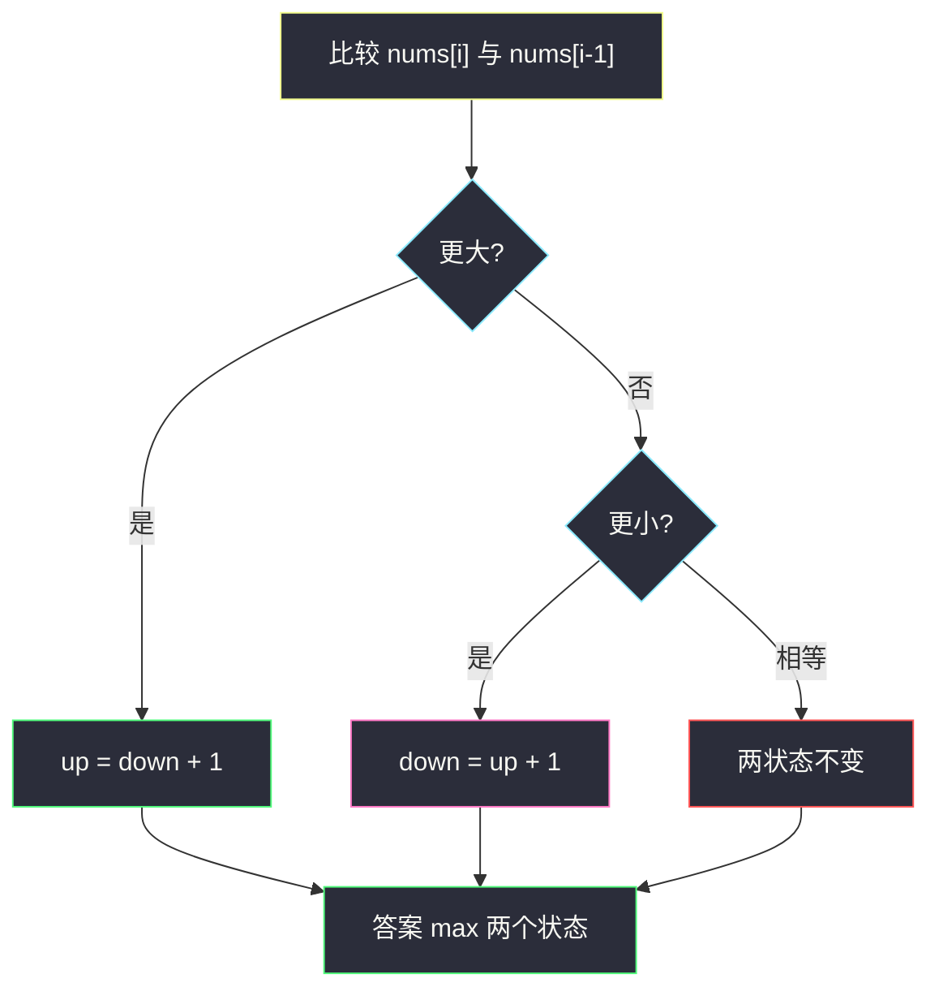
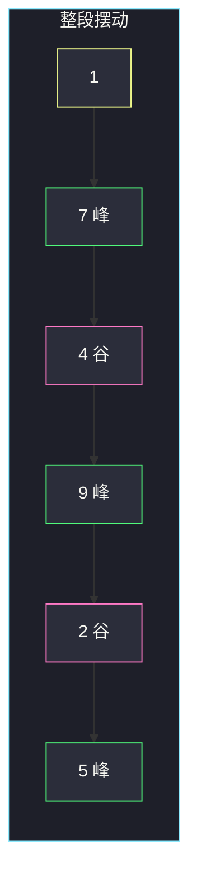

# 摆动序列（状态机：峰 / 谷）

## 一、问题描述

如果一组数的相邻差**严格正负交替**（先升后降，或先降后升都可以），就叫摆动序列。差为 0 不构成一次摆动。给你 `nums`，求其中最长摆动**子序列**的长度。单个元素长度算 1；两个不等元素长度算 2。

> 🔗 LeetCode 376：https://leetcode.cn/problems/wiggle-subsequence/
>
> 数据范围：`1 ≤ n ≤ 1000`，`-1000 ≤ nums[i] ≤ 1000`。
>
> 📚 灵茶题单：**§6.2 基础**（状态机 DP）。和买卖股票、双轨道能量一样：每个位置只区分「当前处在上升结尾 / 下降结尾」两个状态。也可以贪心只数峰谷，答案相同。

方法名 `wiggleMaxLength`。

**示例 1**

```
输入：nums = [1,7,4,9,2,5]
输出：6
解释：整段都是摆动：1<7>4<9>2<5。
```

**示例 2**

```
输入：nums = [1,17,5,10,13,15,10,5,16,8]
输出：7
解释：例如 1,17,10,13,10,16,8（中间单调上升的 10,13,15 只留一个峰侧）。
```

**示例 3**

```
输入：nums = [1,2,3,4,5,6,7,8,9]
输出：2
解释：单调序列只能留下两端，中间没有方向翻转。
```

**直观理解**

摆动就是折线的拐点。单调斜坡上无论有多长，对摆动长度只贡献 **1 次方向**（从谷到峰，或从峰到谷）。所以最长摆动 = 把相邻相等压掉之后，数「方向改变了多少次」再加端点。状态机 DP 用 `up` / `down` 把这件事写成递推。

---

## 二、暴力解法

`dp[i][0]` / `dp[i][1]`：以 `i` 结尾、最后一段下降 / 上升 的最长摆动。枚举前驱 `j < i`，按 `nums[i]` 与 `nums[j]` 的大小接到另一侧状态。

```python
class Solution:
    def wiggleMaxLength(self, nums: list[int]) -> int:
        n = len(nums)
        up = [1] * n
        down = [1] * n
        for i in range(n):
            for j in range(i):
                if nums[i] > nums[j]:
                    up[i] = max(up[i], down[j] + 1)
                elif nums[i] < nums[j]:
                    down[i] = max(down[i], up[j] + 1)
        return max(max(up), max(down))
```

官方三例都能过。时间 `O(n²)`。`n=1000` 勉强能过，但转移其实只跟**相邻一次比较**有关，能压到线性。

### 🔴 瓶颈在哪里

最优摆动不必跳着找很远的前驱：单调区间里只留端点最优。因此只需看 `nums[i]` 相对 `nums[i-1]` 是升、降还是平，把两个全局状态滚过来。

---

## 三、优化探索（核心章节）

> 📚 本题在灵茶题单中属于 **§6.2 基础**。模板：两个滚动状态。升的时候只能接在「上一处是降」的序列后面；降同理。相等则两状态都不动。

### 3.1 状态

扫到 `i` 时：

- `up`：目前最长的、**最后一次差为正**（以波峰结尾）的摆动长度；
- `down`：目前最长的、**最后一次差为负**（以波谷结尾）的摆动长度。

初始：只有 `nums[0]`，`up = down = 1`。

### 3.2 转移

看 `nums[i]` 与 `nums[i-1]`（不是和任意前驱）：

- `nums[i] > nums[i-1]`：当前是一次上升，`up = down + 1`；
- `nums[i] < nums[i-1]`：当前是一次下降，`down = up + 1`；
- 相等：什么都不做。

答案 `max(up, down)`。

为什么用「相邻」就够：若 `1,2,3` 连续上升，第一次 `2>1` 时 `up = down+1 = 2`；再 `3>2` 时 `up = down+1` 仍是 2，因为 `down` 没变。单调段不会把长度刷上去。一旦出现下降，`down = up+1` 接到那个峰上。



### 3.3 贪心：数峰谷

从左到右记录上一次**被计入的差的符号** `prev_diff`。仅当当前差与 `prev_diff` 反向（或从 0 变成非 0）时，长度 `+1` 并更新符号。差为 0 既不加长度也不改符号。

这和状态机是同一件事：状态机的 `up = down+1` 恰好发生在「出现一次与上一段相反的上升」。贪心版更像在折线上数拐点。

### 3.4 一句话核心

> **两个状态峰和谷；升则 up=down+1，降则 down=up+1；平的跳过。**

---

## 四、代码实现

### Python（主解：up / down 状态机）

```python
class Solution:
    def wiggleMaxLength(self, nums: list[int]) -> int:
        # up / down：以升 / 降结尾的最长摆动
        up = down = 1
        for i in range(1, len(nums)):
            if nums[i] > nums[i - 1]:
                up = down + 1
            elif nums[i] < nums[i - 1]:
                down = up + 1
        return max(up, down)
```

`n=1` 时循环不进，返回 1，符合题意。

### Python（贪心数拐点）

```python
class Solution:
    def wiggleMaxLength(self, nums: list[int]) -> int:
        n = len(nums)
        if n < 2:
            return n
        ans = 1
        prev = 0
        for i in range(1, n):
            d = nums[i] - nums[i - 1]
            if d > 0 and prev <= 0:
                ans += 1
                prev = d
            elif d < 0 and prev >= 0:
                ans += 1
                prev = d
        return ans
```

**变量含义**

| 写法 | 含义 |
|------|------|
| `up` | 当前以「上升」结尾的最长长度 |
| `down` | 当前以「下降」结尾的最长长度 |
| `prev` | 上一次计入摆动的差的符号 |

### Java（最优解：状态机）

```java
class Solution {
    public int wiggleMaxLength(int[] nums) {
        int up = 1, down = 1;
        for (int i = 1; i < nums.length; i++) {
            if (nums[i] > nums[i - 1]) {
                up = down + 1;
            } else if (nums[i] < nums[i - 1]) {
                down = up + 1;
            }
        }
        return Math.max(up, down);
    }
}
```

---

## 五、具体例子演示

### 5.1 官方示例 1：每步都翻转

`[1,7,4,9,2,5]`

| i | nums[i] | 相对上一个 | up | down |
|---|---------|------------|----|------|
| 0 | 1 | | 1 | 1 |
| 1 | 7 | 升 | 2 | 1 |
| 2 | 4 | 降 | 2 | 3 |
| 3 | 9 | 升 | 4 | 3 |
| 4 | 2 | 降 | 4 | 5 |
| 5 | 5 | 升 | 6 | 5 |

`max=6`，对拍官方。



### 5.2 官方示例 2：单调段不加点

`[1,17,5,10,13,15,10,5,16,8]`

| nums[i] | 方向 | up | down | 说明 |
|---------|------|----|------|------|
| 1 | | 1 | 1 | |
| 17 | 升 | 2 | 1 | |
| 5 | 降 | 2 | 3 | |
| 10 | 升 | 4 | 3 | |
| 13 | 升 | 4 | 3 | down 没变，up 仍是 4 |
| 15 | 升 | 4 | 3 | 继续爬坡，长度不加 |
| 10 | 降 | 4 | 5 | 拐点 |
| 5 | 降 | 4 | 5 | 继续下坡，长度不加 |
| 16 | 升 | 6 | 5 | |
| 8 | 降 | 6 | 7 | |

`max=7`，对拍官方。`10,13,15` 这段只让「峰侧」保持长度 4，不会变成 5、6。

### 5.3 官方示例 3：纯上升

`[1,2,3,4,5,6,7,8,9]`

第一次 `2>1`：`up=2`。之后每次仍是升，`up = down+1 = 2`。`max=2`。对拍官方。

全相等 `[1,1,1]`：从未进入升降分支，答案 1。

---

## 六、复杂度分析

| 方法 | 时间 | 空间 | 说明 |
|------|------|------|------|
| 枚举前驱 DP | `O(n²)` | `O(n)` | `n=1000` 能过，非最优 |
| 状态机 / 贪心（主解） | `O(n)` | `O(1)` | 每个相邻对看一次 |

---

## 七、对比总结

| 维度 | 300 LIS | 122 买卖股票 II | 本题 |
|------|---------|-----------------|------|
| 状态 | 长度或 tails | 持有 / 不持有 | 峰结尾 / 谷结尾 |
| 单调段 | 能继续变长 | 吃每一段涨幅 | **只计一次翻转** |
| 相等 | 不延长 | 无差价 | 差 0 不是摆动 |

**易错点**

1. **差为 0 仍 `+1`**：题面不算摆动，两状态保持。
2. **用 `nums[i]` 和任意 `j` 比大小却漏了「必须另一侧状态」**：同侧升接升不是摆动。
3. **以为答案是峰谷个数不加端点**：一个元素是 1；单调两个端点是 2。
4. **把子序列理解成子数组**：可以删掉单调段中间的点，示例 2 就是这样。
5. **升的时候写成 `up = up+1`**：必须接到 `down` 上，否则单调上升会一路加到 n。

---

## 八、举一反三

| 题目 | 关系 |
|------|------|
| [3259. 超级饮料的最大强化能量](https://leetcode.cn/problems/maximum-energy-boost-from-two-drinks/) | 同目录 `maximum-energy-boost-from-two-drinks.md`，同属 §6.2 两状态 |
| [122. 买卖股票的最佳时机 II](https://leetcode.cn/problems/best-time-to-buy-and-sell-stock-ii/) | 峰谷：涨段全吃，状态机持仓 |
| [978. 最长湍流子数组](https://leetcode.cn/problems/longest-turbulent-subarray/) | 摆动的**子数组**版，不能删中间 |
| [162. 寻找峰值](https://leetcode.cn/problems/find-peak-element/) | 只要一个峰，不是最长交替 |
| [334. 递增的三元子序列](https://leetcode.cn/problems/increasing-triplet-subsequence/) | 同批：那题要单向递增 3 个，本题要变向 |
| [1218. 最长定差子序列](https://leetcode.cn/problems/longest-arithmetic-subsequence-of-given-difference/) | 同批：差固定，不是正负交替 |

**思想迁移**

- 序列上「两种姿态来回切」就写两个滚动状态，转移接到另一侧。
- 口诀：**「升接谷，降接峰；平的不动；单调段不加长度。」**
