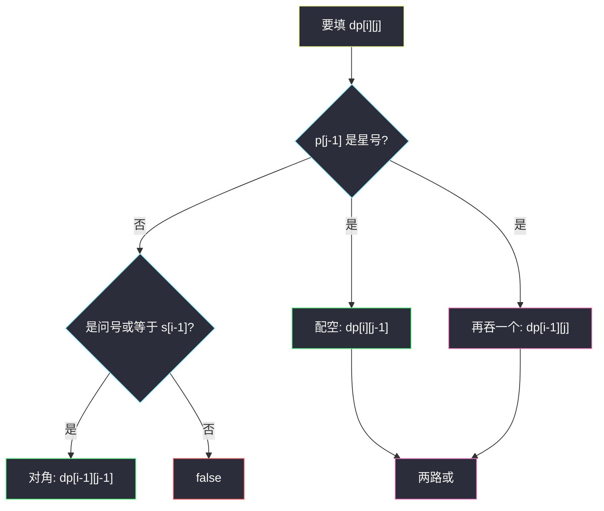
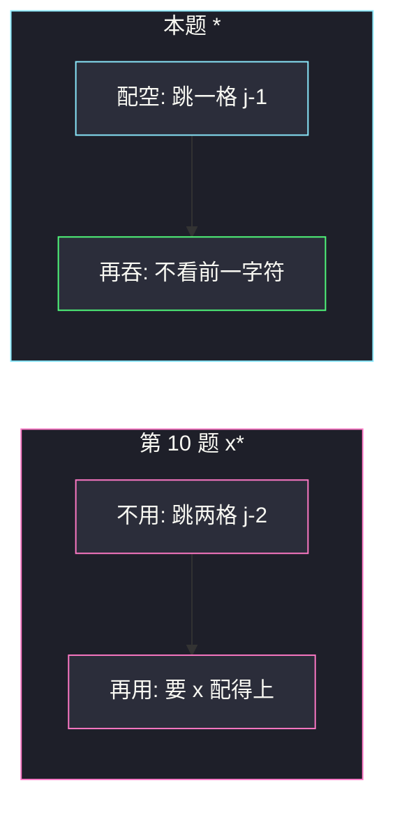

# 通配符匹配（LCS 型二维布尔 DP）

## 一、问题描述

实现通配符匹配：判断模式 `p` 是否**完整覆盖**字符串 `s`。

- `'?'` 匹配**任意一个**字符。
- `'*'` 匹配**任意字符序列**（含空串）。注意：这里的 `'*'` **不依赖**前一个字符，自己就是一个能吞任意长度的符号。

> 🔗 LeetCode 44：https://leetcode.cn/problems/wildcard-matching/
>
> 数据范围：`s`、`p` 长度可达数千，必须 `O(mn)` DP 或等价双指针；指数回溯会超时。只含小写、`?`、`*`。
>
> 📚 灵茶题单：**§4.1 最长公共子序列（LCS）**。仍是双串前缀表 `dp[i][j]`。和第 10 题同名方法 `isMatch`，唯一关键差别：第 10 题的 `*` 是量词（`x*`），本题的 `*` 是独立通配。

方法名 `isMatch`。

**示例 1**

```
输入：s = "aa", p = "a"
输出：false
解释：模式只覆盖一个 a。
```

**示例 2**

```
输入：s = "aa", p = "*"
输出：true
解释：单独一个 '*' 匹配任意字符串，包括 "aa"。
```

**示例 3**

```
输入：s = "cb", p = "?a"
输出：false
解释：'?' 配 c，接着模式要 a，实际是 b。
```

**直观理解**

把 `p` 里的普通字母当成必须出现的锚点，`?` 当成单格万能，`*` 当成可以拉开任意长的橡皮筋（包括长度 0）。从左到右用这些零件拼出整个 `s`。

和第 10 题对比记：

| | 第 10 题正则 | 本题通配符 |
|--|-------------|------------|
| `.` / `?` | `.` 配一个 | `?` 配一个 |
| `*` | 量词，看前一个元素 | 独立，配任意一段（含空） |
| `a*` 的含义 | 若干个 a | 一个 a，后面再跟任意一段 |

---

## 二、暴力解法

`i`、`j` 扫两串。遇到 `*` 就：要么跳过它（配空），要么它吞 `s[i]` 后 `j` 不动。遇到 `?` 或相同字母则两指针都进。

```python
class Solution:
    def isMatch(self, s: str, p: str) -> bool:
        def dfs(i: int, j: int) -> bool:
            if j == len(p):
                return i == len(s)
            if p[j] == '*':
                # 配空，或吞一个字符（i 未越界）
                return dfs(i, j + 1) or (i < len(s) and dfs(i + 1, j))
            first = i < len(s) and (p[j] == '?' or p[j] == s[i])
            return first and dfs(i + 1, j + 1)

        return dfs(0, 0)
```

官方三例：false / true / false。额外常见例：`s="adceb", p="*a*b*" → true`；`s="acdcb", p="a*c?b" → false`。

连续多个 `*` 时每步两岔，`O(2^{m+n})`，长度到 10^3 不可用。`(i,j)` 重复计算。

### 🔴 瓶颈在哪里

状态仍是两前缀，`(m+1)*(n+1)` 个格子。星号的「吞或不吞」变成格子之间的或。填表 `O(mn)`，`m,n` 上千也能过。

---

## 三、优化探索（核心章节）

> 📚 与 97、10 同一张表。本题星号更简单：不看 `p[j-2]`。

### 3.1 状态

`dp[i][j]` = `s` 前 `i` 个字符能否被 `p` 前 `j` 个字符完整匹配。

目标：`dp[m][n]`。

### 3.2 转移

看 `p[j-1]`：

**A. 普通字母或 `?`**

```
配得上  ⇔  i>0 且 (p[j-1]=='?' 或 p[j-1]==s[i-1])
dp[i][j] = 配得上 且 dp[i-1][j-1]
```

和正则里「非星号」完全一样，只是万能符从 `.` 换成 `?`。

**B. `*`**

`*` 自己就能配空或配任意非空。两种取或：

1. **配空**：扔掉这个星号，`dp[i][j-1]`。
2. **再吞 `s` 的一个字符**：星号留着，`dp[i-1][j]`（要求 `i>0`）。

```
dp[i][j] = dp[i][j-1] or dp[i-1][j]
```

没有「前面那个元素配不配得上」的判断。这是和第 10 题唯一的公式级差别。

连续吞：`dp[i-1][j]` 自己还可以再走「再吞」，于是一个 `*` 吃掉任意长后缀。



### 3.3 空串边界

`dp[0][0] = True`。

`s` 为空时，`p` 必须全是 `*` 才能匹配（每个星号配空）：

```
若 p[j-1]=='*'：dp[0][j] = dp[0][j-1]
否则：False
```

注意和第 10 题不同：正则空串行是 `dp[0][j-2]`（一次跳过 `x*` 两个字符）；这里一次只跳过一个 `*`。`p="*****"` 配空是 true，五个星号一路 `T` 传过来。

`p` 为空、`s` 非空：第一列全 false。

### 3.4 和第 10 题并排对照

同一对串 `s="aa"`，模式写成 `a*`：

- 正则：`a*` = 若干个 a → true。
- 通配符：`a*` = 先配一个 a，再让 `*` 吃掉剩下 → 也是 true。

换 `s="ab"`，`p="a*"`：

- 正则：`*` 只能重复 a，配不了 b → false。
- 通配符：`*` 可以吃 b → true。

这是两题语义分叉的最小例子。写代码时不要把第 10 题的 `j-2` 抄过来。



### 3.5 填表顺序与滚动

依赖左边 `dp[i][j-1]` 和上边 `dp[i-1][j]`（星号），或左上（普通）。`i`、`j` 升序。

可以滚成一维：`dp[j]` 表示当前行。内层 `j` 从小到大时，`dp[j]` 覆盖前仍是上一行（当 `dp[i-1][j]`），`dp[j-1]` 已是本行（当配空）。Hard 主解先写二维，滚动作可选。

多个连续 `*` 可以预处理压成一个，正确性不变、常数更好，不是必须。

### 3.6 贪心双指针（了解即可）

从左扫，遇到 `*` 记下位置，s 失配时回退到上一个 `*` 让它多吞一个。`O(mn)` 最坏、平均很快。面试能讲 DP 即可；双指针容易写错回退。本题按题单走 DP。

### 3.7 一句话核心

> **`dp[i][j]`：两前缀能否匹配；`?` 当单格万能，`*` 是「左边或上边」两路或。**

---

## 四、代码实现

### Python（主解：二维 DP）

```python
class Solution:
    def isMatch(self, s: str, p: str) -> bool:
        m, n = len(s), len(p)
        dp = [[False] * (n + 1) for _ in range(m + 1)]
        dp[0][0] = True
        for j in range(1, n + 1):
            if p[j - 1] == '*':
                dp[0][j] = dp[0][j - 1]
        for i in range(1, m + 1):
            for j in range(1, n + 1):
                if p[j - 1] == '*':
                    dp[i][j] = dp[i][j - 1] or dp[i - 1][j]
                elif p[j - 1] == '?' or p[j - 1] == s[i - 1]:
                    dp[i][j] = dp[i - 1][j - 1]
        return dp[m][n]
```

### Python（滚动一维）

```python
class Solution:
    def isMatch(self, s: str, p: str) -> bool:
        m, n = len(s), len(p)
        dp = [False] * (n + 1)
        dp[0] = True
        for j in range(1, n + 1):
            if p[j - 1] == '*':
                dp[j] = dp[j - 1]
        for i in range(1, m + 1):
            ndp = [False] * (n + 1)
            # s 非空时，空模式匹配失败，ndp[0] 保持 False
            for j in range(1, n + 1):
                if p[j - 1] == '*':
                    ndp[j] = ndp[j - 1] or dp[j]
                elif p[j - 1] == '?' or p[j - 1] == s[i - 1]:
                    ndp[j] = dp[j - 1]
            dp = ndp
        return dp[n]
```

滚动版另开 `ndp`，避免星号同时需要「本行左边」和「上一行当前列」时覆盖冲突。官方三例同样 false / true / false。

### Java

```java
class Solution {
    public boolean isMatch(String s, String p) {
        int m = s.length(), n = p.length();
        boolean[][] dp = new boolean[m + 1][n + 1];
        dp[0][0] = true;
        for (int j = 1; j <= n; j++) {
            if (p.charAt(j - 1) == '*') {
                dp[0][j] = dp[0][j - 1];
            }
        }
        for (int i = 1; i <= m; i++) {
            for (int j = 1; j <= n; j++) {
                if (p.charAt(j - 1) == '*') {
                    dp[i][j] = dp[i][j - 1] || dp[i - 1][j];
                } else if (p.charAt(j - 1) == '?' || p.charAt(j - 1) == s.charAt(i - 1)) {
                    dp[i][j] = dp[i - 1][j - 1];
                }
            }
        }
        return dp[m][n];
    }
}
```

**变量含义**

| 写法 | 含义 |
|------|------|
| `dp[i][j]` | `s[:i]` 配 `p[:j]` |
| `dp[i][j-1]` | 这个 `*` 配空 |
| `dp[i-1][j]` | 这个 `*` 再吞 `s[i-1]` |

---

## 五、具体例子演示

`.` 表示 false，`T` 表示 true。

### 5.1 官方示例 1：`s="aa"`，`p="a"`

| i \ j | ε | a |
|-------|---|---|
| ε | T | . |
| a | . | T |
| a | . | . |

与第 10 题同一张否表。`dp[2][1]=false`，对拍官方。

### 5.2 官方示例 2：逐格填 `s="aa"`，`p="*"`

空串行：`p[0]=='*'`，`dp[0][1] = dp[0][0] = T`。

| i \ j | ε | * |
|-------|---|---|
| ε | T | T |
| a | . | T |
| a | . | T |

- `dp[1][1]`：配空看左边 `dp[1][0]=false`；再吞看上边 `dp[0][1]=T` → T。星号吞第一个 a。
- `dp[2][1]`：再吞，上边已是 T → T。星号吞第二个 a。

`dp[2][1]=T`，对拍官方。空模式列始终 false，说明「必须靠这个星号把 s 全吃掉」。

### 5.3 官方示例 3：`s="cb"`，`p="?a"`

| i \ j | ε | ? | a |
|-------|---|---|---|
| ε | T | . | . |
| c | . | T | . |
| b | . | . | . |

`dp[1][1]`：`?` 配 `c`，左上 T。  
`dp[1][2]`：`a` 对 `c`，不等，false。  
`dp[2][1]`：只有一个 `?`，吃不了两个字符。  
`dp[2][2]`：`a` 对 `b`，不等；即使 `?` 配了 `c`，第二个字符也对不上。

右下 false，对拍官方。

### 5.4 额外官方例：`s="adceb"`，`p="*a*b*"` → true

| i \ j | ε | * | a | * | b | * |
|-------|---|---|---|---|---|---|
| ε | T | T | . | . | . | . |
| a | . | T | T | T | . | . |
| d | . | T | . | T | . | . |
| c | . | T | . | T | . | . |
| e | . | T | . | T | . | . |
| b | . | T | . | T | T | T |

读表：

- 第一列 `*`：空串行 T 之后，整列一直 T。单独这个星号已经能匹配 s 的任意前缀。
- `a` 列：只有 `s` 的第一个 a 能对角配上（`dp[1][2]`）。后面的 d/c/e/b 对 a 都 false。第二个 `*` 从 `dp[1][2]` 把 true **竖着传下去**（再吞），于是 `d,c,e,b` 在第三列全 T——含义是「已经用掉模式的 `*a*`，s 的前缀任意延长」。
- `b` 列：在最后一行，`s[4]='b'` 对角配 `p` 的 `b`，左上 `dp[4][3]=T` → `dp[5][4]=T`。末尾再一个 `*` 配空，`dp[5][5]=T`。

右下 T，对拍官方。路径直觉：`*` 吃空，`a` 锚住第一个 a，`*` 吃 `dce`，`b` 锚住末尾 b，`*` 吃空。

### 5.5 额外官方例：`s="acdcb"`，`p="a*c?b"` → false

| i \ j | ε | a | * | c | ? | b |
|-------|---|---|---|---|---|---|
| ε | T | . | . | . | . | . |
| a | . | T | T | . | . | . |
| c | . | . | T | T | . | . |
| d | . | . | T | . | T | . |
| c | . | . | T | T | . | . |
| b | . | . | T | . | T | . |

空串行：模式不以 `*` 起头，后面那个 `*` 也救不了空串行的 `a` 列（`a` 不能配空），所以 `dp[0][2]` 起全 false。

右下 `dp[5][5]`：最后要 `b` 配 `b`，需要左上 `dp[4][4]`。`dp[4][4]` 是 `?` 配 `c`，再往左上是 `dp[3][3]`——那一格是 `c` 配 `d`，false。另一条候选 `dp[5][4]`（`?` 配最后的 b）是 T，但那是 `?` 列不是 `b` 列。模式末尾的 `b` 对不上「`?` 已经用在别的位置」之后剩下的字符。

对拍官方 false。

### 5.6 边界

- `s=""`，`p=""` → true。
- `s=""`，`p="*****"` → 空串行一路 T，true。
- `s="a"`，`p=""` → `dp[1][0]=false`。
- `s="abc"`，`p="*"` → 星号列全 T，true。
- `s="aa"`，`p="a*"`（通配符语义）：

| i \ j | ε | a | * |
|-------|---|---|---|
| ε | T | . | . |
| a | . | T | T |
| a | . | . | T |

第一个 a 锚住，`*` 吞第二个 a。true。若这是正则 `a*` 也是 true；换成 `s="ab"` 两题就会分叉（本题 true，第 10 题 false）。

---

## 六、复杂度分析

| 方法 | 时间 | 空间 | 说明 |
|------|------|------|------|
| 暴力 DFS | 指数 | `O(m+n)` | 超时 |
| 二维 DP（主解） | `O(mn)` | `O(mn)` | 长度 10^3 级可过 |
| 滚动一维 | `O(mn)` | `O(n)` | 可选 |

---

## 七、对比总结

| 格子 | 第 10 题 | 本题 |
|------|----------|------|
| 万能单字符 | `.` | `?` |
| 星号配空 | `dp[i][j-2]` | `dp[i][j-1]` |
| 星号再吞 | 需 `x` 配得上，然后 `dp[i-1][j]` | 无条件 `dp[i-1][j]` |
| 空串行 | 按 `x*` 两格一跳 | 连续 `*` 一格一跳 |

**易错点**

1. **抄第 10 题的 `j-2`。** 本题 `*` 只占一格。
2. **星号再吞时还去比 `p[j-2]`。** 通配符没有「前面那个元素」。
3. **空串行写成 `j-2`。** `p="*"` 配空会失败。
4. **`?` 配空。** `?` 必须吃恰好一个字符，`s=""`、`p="?"` 是 false。
5. **子串匹配。** 仍是整串，右下角才是答案。
6. **一维滚动把星号写成 `dp[j] = dp[j] or dp[j-1]` 却用错旧新。** 拿不准就开 `ndp`。

**模板**

通配符：普通 / 问号走对角；星号 `左 or 上`。正则星号：`左左 or (配得上 and 上)`。

---

## 八、举一反三

| 题目 | 关系 |
|------|------|
| [10. 正则表达式匹配](https://leetcode.cn/problems/regular-expression-matching/) | 同目录上一篇；先分清 `*` 语义再写公式 |
| [97. 交错字符串](https://leetcode.cn/problems/interleaving-string/) | §4.1 双串前缀布尔 |
| [1143. 最长公共子序列](https://leetcode.cn/problems/longest-common-subsequence/) | 原型 |
| [72. 编辑距离](https://leetcode.cn/problems/edit-distance/) | 同一张表 |
| [583. 两个字符串的删除操作](https://leetcode.cn/problems/delete-operation-for-two-strings/) | LCS 应用 |
| [115. 不同的子序列](https://leetcode.cn/problems/distinct-subsequences/) | 布尔改计数 |

**思想迁移**

- 模式多一种符号，只改对应列的转移，状态不要拆。
- 口诀：**「问号当一点；星号左或上，不看前一格。」**
