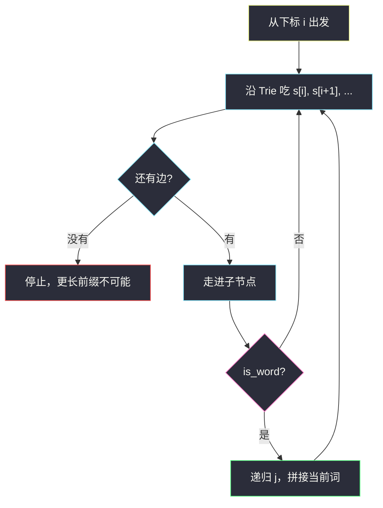
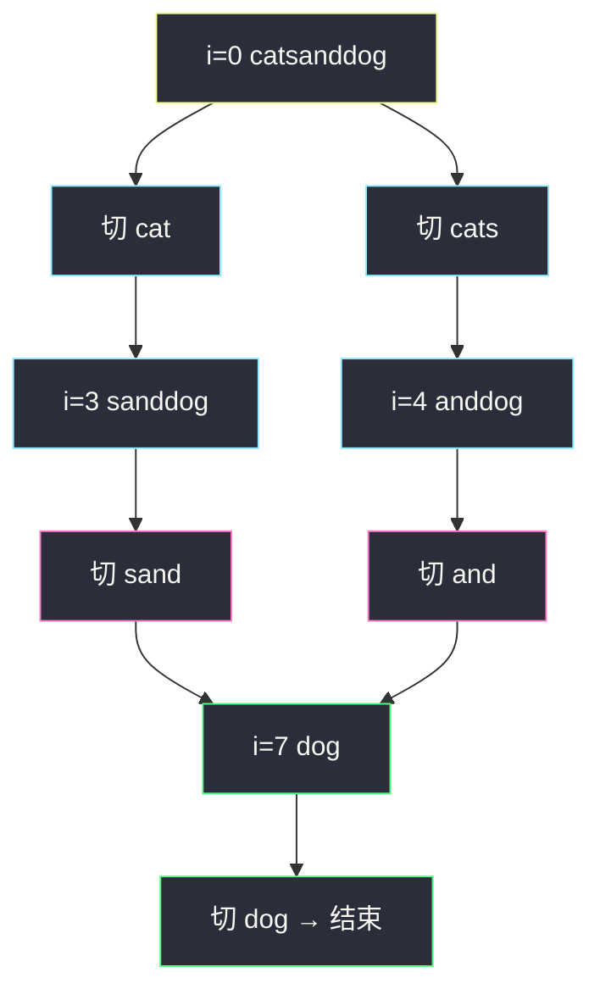

# 单词拆分 II（回溯记忆化 + 字典树）

## 一、问题描述

给你字符串 `s` 和字符串列表 `wordDict` 作为字典，在字符串中增加空格来构建一个句子，使得句子中每个单词都在字典中。返回所有这些可能的句子。

字典中的单词可以重复使用。题目保证字典无重复词。无解时返回空列表。

> 🔗 LeetCode 140：https://leetcode.cn/problems/word-break-ii/
>
> 数据范围：`1 <= s.length <= 20`，`1 <= wordDict.length <= 1000`，`1 <= wordDict[i].length <= 10`。`s` 和单词只含小写字母。
>
> 📚 灵茶题单：**字典树 · §6.3 字典树优化 DP**。先有 [139. 单词拆分](https://leetcode.cn/problems/word-break/) 的可行性，本题要**列出全部拆法**。

**示例 1**

```
输入：s = "catsanddog", wordDict = ["cat","cats","and","sand","dog"]
输出：["cats and dog","cat sand dog"]
```

**示例 2**

```
输入：s = "pineapplepenapple", wordDict = ["apple","pen","applepen","pine","pineapple"]
输出：["pine apple pen apple","pineapple pen apple","pine applepen apple"]
```

**示例 3**

```
输入：s = "catsandog", wordDict = ["cats","dog","sand","and","cat"]
输出：[]
解释：怎么切都剩不下完整单词，返回空列表。
```

**直观理解**

从左往右切：当前位置能匹配字典里哪个词，就切一刀，继续切后面。`s` 最长 20，切法是一棵不大的树，但同一后缀会被多条路径重复走到——记住「从下标 `i` 出发的全部句子」，避免重算。词多的时候不要对每个位置扫 1000 个词，改成沿字典树走 `s[i..]`，只扩展真正对得上的前缀。

---

## 二、暴力解法

从下标 `i` 枚举结束位置 `j`，若 `s[i:j]` 在集合里，就递归 `j`，把返回的后缀句子拼上当前词。

```python
class Solution:
    def wordBreak(self, s: str, wordDict: List[str]) -> List[str]:
        words = set(wordDict)

        def dfs(i: int) -> List[str]:
            if i == len(s):
                return [""]
            res = []
            for j in range(i + 1, len(s) + 1):
                w = s[i:j]
                if w in words:
                    for tail in dfs(j):
                        res.append(w if not tail else w + " " + tail)
            return res

        return dfs(0)
```

`s = "aaaa…"` 且字典含大量 `a`、`aa`、`aaa` 时，同一 `i` 会被指数次重复进入。`s ≤ 20` 多数能过，最坏仍很难看。面试要补记忆化；无解串还要先用 139 的可行性剪掉。

### 复杂度

- **时间**：最坏指数级，且大量重复子问题。设答案句数为 `k`、均长 `n`，仅把答案写出来就要 `O(kn)`。
- **空间**：递归深度 `O(n)`，答案本身 `O(kn)`。

### 🔴 瓶颈在哪里

1. **重复后缀**：`cat sand dog` 和另一条路径若都能走到 `"dog"` 的起点，后面的拆法应只算一次。
2. **瞎枚举切点**：`j` 从 `i+1` 扫到 `n`，多数子串不在字典里。沿 Trie 走，只有「当前前缀真是某词的前缀」才继续。
3. **无解仍爆搜**：先 `O(n²)` 做 139，不可拆则直接 `[]`。

---

## 三、优化探索（核心章节）

> 📚 本题在灵茶题单中属于 **§6.3 字典树优化 DP**。139 是「`dp[i]` = 前缀能否拆」；140 把布尔值换成「从 `i` 出发的句子列表」。字典树把「枚举切点 + 哈希查词」收成一次沿串行走。

### 3.1 记忆化：状态是起点，值是句子列表

令 `memo[i]` = 把 `s[i:]` 拆成字典词之后，所有可能的句子（不含前导空格）。

- `i == n`：一种「空拆法」，记为 `[""]`，方便拼接时判断「后面还有没有词」。
- 否则：所有 `s[i:j]` 在字典中的切法，对每句后缀 `tail`：
  - `tail` 为空：句子就是当前词 `w`
  - 否则：`w + " " + tail`

哈希集合查词已经 `O(词长)`。每个 `i` 只展开一次，不同路径共享同一份 `memo[i]` 列表（引用即可，不要拷贝后再改）。

拼空格容易写错：不能一律 `w + " " + tail`，否则末尾会多一个空格（`tail` 为 `""` 时变成 `"dog "`）。

### 3.2 可行性剪枝（139）

`ok[j] = True` 表示 `s[j:]` 能完全拆开（从后往前或从前往后都行）。回溯时若 `not ok[i]`，直接返回 `[]`。示例 3 `"catsandog"` 在进入搜索前就能整表判死，不会在错误前缀上穷举。

注意：`ok` 只回答「有没有至少一种拆法」，列出句子仍要 DFS；它只负责把失败分支剪成空。

### 3.3 字典树：对齐 §6.3

把 `wordDict` 建成 Trie。每个节点：

- `children[c]`：下一字母
- `is_word`：走到这里是否成词

从起点 `i` 匹配时，指针 `node` 从根出发，依次吃 `s[i], s[i+1], …`：

- 没有边：后面更长的前缀也不可能是词，**立刻停**
- 走到 `is_word`：找到一个切点 `j = 当前下标 + 1`，去递归 `j`

这样每个起点最多走 `min(10, n-i)` 步（词长 ≤ 10），与 `wordDict` 有 1000 个词无关，也不用对每个 `j` 切片、哈希。



### 3.4 拆分树长什么样

`s = "catsanddog"` 时，从 0 出发只有两条能走到底的路径（见第五章）。失败分支例如 `"cat"` 之后切 `"san"`——字典没有，Trie 走不下去；`"catsand"` 也不是词。树不宽，记忆化后 `"dog"` 的起点只展开一次。

### 3.5 一句话核心

> **`memo[i]` 缓存 `s[i:]` 的全部句子；从 `i` 沿字典树往前走，碰到单词终点就切一刀。空格只加在两个词中间，无解返回 `[]`。**

---

## 四、代码实现

### Python（主解：Trie + 记忆化）

```python
class TrieNode:
    def __init__(self):
        self.children = {}
        self.is_word = False


class Solution:
    def wordBreak(self, s: str, wordDict: List[str]) -> List[str]:
        root = TrieNode()
        for w in wordDict:
            node = root
            for ch in w:
                node = node.children.setdefault(ch, TrieNode())
            node.is_word = True

        n = len(s)
        memo = {}

        def dfs(i: int) -> List[str]:
            if i in memo:
                return memo[i]
            if i == n:
                return [""]
            res = []
            node = root
            for j in range(i, n):
                ch = s[j]
                if ch not in node.children:
                    break
                node = node.children[ch]
                if node.is_word:
                    w = s[i:j + 1]
                    for tail in dfs(j + 1):
                        res.append(w if not tail else w + " " + tail)
            memo[i] = res
            return res

        return dfs(0)
```

若先做 139 剪枝，在 `dfs` 开头加：不可达则 `memo[i] = []` 并返回。主解里记忆化已经保证失败起点只走一次，`s ≤ 20` 时两种都稳。

**变量含义**

| 变量 | 含义 |
|------|------|
| `root` | 词典 Trie 根 |
| `node` | 从 `s[i]` 走到 `s[j]` 后所在的 Trie 节点 |
| `memo[i]` | `s[i:]` 的全部句子；未计算不在表里 |
| `tail` | 后缀的一种拆法；空串表示已经切到末尾 |

### Python（集合版，好默写）

```python
class Solution:
    def wordBreak(self, s: str, wordDict: List[str]) -> List[str]:
        words = set(wordDict)
        n = len(s)
        memo = {}

        def dfs(i: int) -> List[str]:
            if i in memo:
                return memo[i]
            if i == n:
                return [""]
            res = []
            for j in range(i + 1, n + 1):
                w = s[i:j]
                if w in words:
                    for tail in dfs(j):
                        res.append(w if not tail else w + " " + tail)
            memo[i] = res
            return res

        return dfs(0)
```

词短、`n` 小，集合版足够交题。§6.3 的考点是 Trie 那一版。

### Java（最优解同款：Trie + 记忆化）

```java
class Solution {
    static class TrieNode {
        TrieNode[] children = new TrieNode[26];
        boolean isWord;
    }

    public List<String> wordBreak(String s, List<String> wordDict) {
        TrieNode root = new TrieNode();
        for (String w : wordDict) {
            TrieNode node = root;
            for (int k = 0; k < w.length(); k++) {
                int idx = w.charAt(k) - 'a';
                if (node.children[idx] == null) {
                    node.children[idx] = new TrieNode();
                }
                node = node.children[idx];
            }
            node.isWord = true;
        }
        Map<Integer, List<String>> memo = new HashMap<>();
        return dfs(s, 0, root, memo);
    }

    private List<String> dfs(String s, int i, TrieNode root,
                             Map<Integer, List<String>> memo) {
        if (memo.containsKey(i)) {
            return memo.get(i);
        }
        List<String> res = new ArrayList<>();
        if (i == s.length()) {
            res.add("");
            memo.put(i, res);
            return res;
        }
        TrieNode node = root;
        for (int j = i; j < s.length(); j++) {
            int idx = s.charAt(j) - 'a';
            if (node.children[idx] == null) {
                break;
            }
            node = node.children[idx];
            if (node.isWord) {
                String w = s.substring(i, j + 1);
                for (String tail : dfs(s, j + 1, root, memo)) {
                    res.add(tail.isEmpty() ? w : w + " " + tail);
                }
            }
        }
        memo.put(i, res);
        return res;
    }
}
```

---

## 五、具体例子演示

### 5.1 `"catsanddog"` 的拆分树

字典：`cat, cats, and, sand, dog`。先建成 Trie（只画本题用到的边）：

```
root
├─ c → a → t* → s*
├─ s → a → n → d*
├─ a → n → d*
└─ d → o → g*
```

`*` 表示 `is_word`。从 `i = 0` 沿 `c-a-t-s-a-n-d-d-o-g` 走：

| 走到下标 | Trie 路径 | 成词？ | 动作 |
|----------|-----------|--------|------|
| 0 `c` | `c` | 否 | 继续 |
| 1 `a` | `ca` | 否 | 继续 |
| 2 `t` | `cat` | 是 | 切出 `"cat"`，递归 `i=3`（`"sanddog"`） |
| 3 `s` | `cats` | 是 | 切出 `"cats"`，递归 `i=4`（`"anddog"`） |
| 4 `a` | 无 `catsa` | — | **停**，不再试更长前缀 |

所以起点 0 只有两刀：`cat | …` 和 `cats | …`。

**分支 A：`i = 3`，剩下 `"sanddog"`**

| 走到 | 路径 | 成词 | 动作 |
|------|------|------|------|
| 3 `s` | `s` | 否 | |
| 4 `a` | `sa` | 否 | |
| 5 `n` | `san` | 否 | |
| 6 `d` | `sand` | 是 | 切 `"sand"`，递归 `i=7`（`"dog"`） |
| 7 `d` | 无 `sandd` | — | 停 |

没有 `"s"`、`"sa"` 这些词。只有 `"sand"`。

**分支 B：`i = 4`，剩下 `"anddog"`**

走到 `and*` 切 `"and"`，递归 `i = 7`。没有更长的 `andd`。

**汇合：`i = 7`，剩下 `"dog"`**

`d-o-g*` 切 `"dog"`，递归 `i = 10` 得 `[""]`。句子就是 `"dog"`。

两条完整路径：

```
"cat"  + " " + "sand" + " " + "dog"  → "cat sand dog"
"cats" + " " + "and"  + " " + "dog"  → "cats and dog"
```



记忆化的效果：A、B 都递归到 `i = 7`。第一次算出 `memo[7] = ["dog"]`，第二次直接复用，不会再走一遍 `d-o-g`。

### 5.2 失败路径长什么样

从 `i = 3` 若不用 Trie、盲目切 `"san"`（下标 3..5），集合里没有，循环继续。Trie 版在 `san` 不是词、下一条字母 `d` 才成词，不会对 `"s"`、`"sa"` 发起递归。

示例 3 `"catsandog"`：`"cat"` / `"cats"` 之后分别剩下 `"sandog"` / `"andog"`。`"sand"` 配上后剩 `"og"`，Trie 吃 `o` 没有 `g` 的成词路径；`"and"` 配上后剩 `"og"` 同样失败。`memo[7]` 或相应起点得到 `[]`，一路传回空列表。

### 5.3 空格拼接

`dfs(10)` 返回 `[""]`。拼 `"dog"` 时 `tail` 为空，用 `w` 而不是 `w + " " + ""`。上一层 `"sand"` 的 `tail` 是 `"dog"`，才插入空格。句子从右往左长出来，空格只出现在词与词之间。

---

## 六、复杂度分析

设 `n = |s|`，词典词数 `m`，最长词长 `L`（本题 `n ≤ 20`，`L ≤ 10`），答案句数 `k`。

| 方法 | 时间 | 空间 | 说明 |
|------|------|------|------|
| 朴素切点回溯 | 指数，重复子问题 | `O(n + kn)` | `aaaa` + 多段 `a` 会爆 |
| 集合 + 记忆化 | `O(n² + kn)` 量级查词 | `O(n + kn)` | 每个 `i` 枚举 `j` |
| Trie + 记忆化（主解） | 每个 `i` 沿树最多 `L` 步，加上写出 `k` 句 | Trie `O(总字符)` + 答案 `O(kn)` | 对齐 §6.3 |

写出全部句子是输出下限，无法低于 `O(kn)`。

---

## 七、对比总结

| 维度 | 哈希集合枚举切点 | Trie 沿串走 |
|------|------------------|-------------|
| 查词 | 每个子串一次哈希 | 没有边就停，不碰无效前缀 |
| 与 `m` 的关系 | 间接（哈希常数、切片） | 建树 `O(总字符)`，查询与 `m` 无关 |
| 记忆化 | 两者都要 | 两者都要 |
| 空格 | 相同：`tail` 空则不加 | 相同 |

**易错点**

1. **尾部多空格**：`w + " " + tail` 在 `tail == ""` 时变成 `"dog "`。先判断 `tail`。
2. **返回 `None` / 不写无解**：搜不到应是 `[]`，不是 `[" "]` 或 `None`。
3. **记忆化存了列表之后还往里 `append`**：别的起点共享同一 list，改它会串台。算完一次性赋给 `memo[i]`。
4. **字典词当字符切片错位**：`s[i:j+1]` 才含当前字母 `s[j]`。
5. **以为词不能重复用**：139 / 140 都可以重复用同一词典词；只是本题 `s` 短，重复不明显。
6. **先 139 剪枝时 `ok` 写反**：`ok[n] = True`，转移是「存在一个词接到已经可行的后面」。

**模板（§6.3 从 i 沿 Trie 切词）**

```python
node = root
for j in range(i, n):
    if s[j] not in node.children:
        break
    node = node.children[s[j]]
    if node.is_word:
        # 切 s[i:j+1]，dfs(j+1)
```

---

## 八、举一反三

| 题目 | 关系 |
|------|------|
| [139. 单词拆分](https://leetcode.cn/problems/word-break/) | 只要可行性，`dp[i]` 布尔即可 |
| [472. 连接词](https://leetcode.cn/problems/concatenated-words/) | 词是否由其它词拼成，139 的批量版 |
| [2707. 字符串中的额外字符](https://leetcode.cn/problems/extra-characters-in-a-string/) | 切不掉的字符要付费，Trie / 哈希 DP |
| [140 的网格版：212. 单词搜索 II](https://leetcode.cn/problems/word-search-ii/) | 同样 §6 字典树，搜索空间换成棋盘，见 `word-search-ii.md` |
| [208. 实现 Trie](https://leetcode.cn/problems/implement-trie-prefix-tree/) | 本题 Trie 节点的最小集 |

**思想迁移**

- 见到「按词典切字符串、要全部方案」，状态放在**剩余前缀的起点**；方案列表记忆化，Trie 负责加速「下一个词是什么」。
- 口诀：**「从 i 沿字典树走，成词就切；空格夹中间，后缀记 memo。」**
