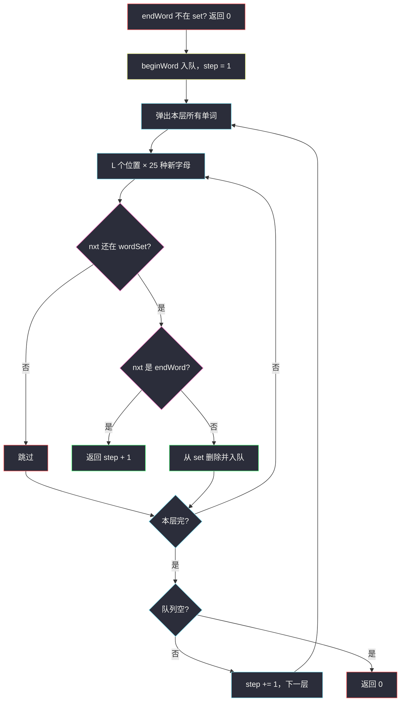
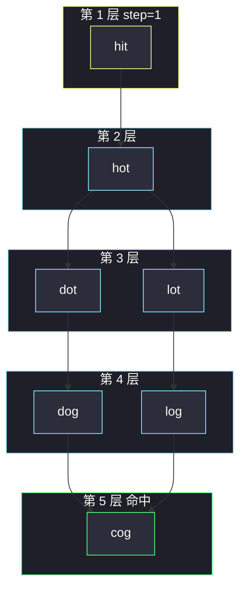

# 单词接龙（单词当点 · 差一位连边 · BFS 最短路）

## 一、问题描述

给定 `beginWord`、`endWord` 和字典 `wordList`。每次只能把当前单词 **改一个字母**，且改完必须仍在 `wordList` 里。求从 `beginWord` 变到 `endWord` 的 **最短转换序列长度**（序列里要算上起点和终点）。变不到返回 `0`。

> 🔗 LeetCode 127：https://leetcode.cn/problems/word-ladder/
>
> 数据范围：所有单词等长，`1 ≤ wordList.length ≤ 5000`，单词长度 `1 ≤ L ≤ 10`，只含小写。`beginWord != endWord`。`beginWord` **可以不在** `wordList` 里。
>
> 📚 灵茶题单：**图论 · §1.3 图论建模 + BFS 最短路**。把状态当节点：一个单词一个点，Hamming 距离 1 就是边权 1。

**示例 1（官方 hit → cog）**

```
输入：beginWord = "hit", endWord = "cog"
     wordList = ["hot","dot","dog","lot","log","cog"]
输出：5
一条最短序列：hit → hot → dot → dog → cog
（5 个单词，4 次改写）
另一条：hit → hot → lot → log → cog，同样长度 5。
```

**示例 2**

```
输入：beginWord = "hit", endWord = "cog"
     wordList = ["hot","dot","dog","lot","log"]
输出：0
字典里没有 cog，终点根本不是合法状态，返回 0。
```

**示例 3**

```
输入：beginWord = "hit", endWord = "hot"
     wordList = ["hot"]
输出：2
只改一位 h→o 且结果在字典里：hit → hot。
```

**直观理解**

合法状态 = `{beginWord} ∪ wordList`。两个单词差恰好一位就连一条边。边权全是 1，最短序列长度 = **BFS 层数（单词个数）**。这和 [打开转盘锁](./open-the-lock.md)、[最小基因变化](./minimum-genetic-mutation.md) 同一套建模：

| | 转盘锁 | 基因变化 | 单词接龙 |
|--|--------|----------|----------|
| 节点 | 4 位数字 | 8 位 ACGT | 等长小写串 |
| 转移 | 某位 ±1 | 某位换成另外 3 种 | 某位换成另外 25 种 |
| 合法约束 | 不是死锁 | 必须在 bank | 必须在 wordList |
| 返回值 | 拨动次数 | 变化次数 | **单词个数**（次数 +1） |

差一位：转盘锁/基因返回的是边数；本题题面要的是序列长度，别忘了 **+1 把起点算进去**。

---

## 二、暴力解法

把 `wordList` 里每两个单词两两比 Hamming，差 1 就建边，再从 `beginWord` 对显式图 DFS/BFS。建图 `O(N² · L)`，`N = 5000`、`L = 10` 约 2.5e8 次字符比较，Python 容易超时。DFS 即使图画出来了，第一次碰到终点也不保证最短。

```python
# 伪代码：
# 对 i,j 比较 word[i] 与 word[j] 是否只差一位，建无向图
# dfs(u, step)，seen 防环，见到 endWord 更新 ans
# N=5000 建图就很慢，DFS 还要回溯，不该这么写
```

另一种「暴力」：不建图，DFS 每次枚举 `L × 25` 种改法，落到字典里就递归。状态最多 `N+1` 个，但搜索树会反复走长路，必须记录最优步数，常数和剪枝都难看。

### 复杂度

- **时间**：显式建图 `O(N² L)`；DFS 最坏再乘排列。
- **空间**：邻接表 `O(N²)` 最坏（几乎每个词都互相差一位时）。

### 🔴 瓶颈在哪里

边权是 1，**先到终点的一定更短**。不该 DFS。建图也不该 `N²` 两两比——弹出一个词时，现场枚举 26L 种变异，用 `set` 判断在不在字典里，隐式 BFS 即可。

---

## 三、优化探索（核心章节）

> 📚 本题在灵茶题单中属于 **§1.3 图论建模 + BFS**。单词当顶点；改一个字母且结果在字典为边；`wordList` 转 set；BFS 第一次碰到 `endWord` 时，当前层号 +1 就是序列长度。

### 3.1 建模：状态 = 单词

每个不同的字符串是一个节点。`beginWord` 即使不在 `wordList` 里也要当起点放进图——题目允许从它出发，只要求 **中间和终点** 在字典里。

边：`u → v` 当且仅当 `v` 在字典（或就是终点，终点必须在字典）且恰好差一位。无向：差一位是对称的。

**特殊判定必须先写：**

- `endWord not in wordList` → 返回 `0`。终点不合法，后面怎么搜都到不了。示例 2 就是这个坑。
- 题目保证 `beginWord != endWord`，不必处理长度为 1 的「已经在终点」。

### 3.2 隐式 BFS（默写主解）

不必预建邻接表。弹出 `u` 后：

1. 把 `u` 转成字符数组（或直接切片）。
2. 枚举位置 `i = 0 .. L-1`，枚举字母 `a..z`（可跳过原来的字母）。
3. 得到 `nxt`。若 `nxt` 还在剩余字典里，入队并立刻从 set 里删掉（等价于 `visited`）。

`wordList` 转成 `set` 后，查询/删除 `O(1)` 平均。入队即删除，保证每个单词只扩展一次。

层数怎么数：起点自己算第 1 个单词。按层 `for _ in range(len(q))` 扩展邻居时，若邻居就是 `endWord`，返回 `step + 1`。扩完一层再 `step += 1`。



### 3.3 正确性

- 图是无权的：BFS 按「改写次数」分层。第 `k` 层都是恰好改了 `k` 次得到的单词。
- 序列长度 = 改写次数 + 1 = 层号（把起点当第 1 层）。第一次把 `endWord` 作为邻居生成时，改写次数是当前层的次数 +1，单词个数是 `step + 1`。
- `seen` / 从 set 删除：同一单词从更长路径再次到达时步数只多不少，丢弃不影响最优。
- 不把 `beginWord` 必须放进字典：生成邻居时查的是 `wordList` 的 set；起点只用来扩展，不需要「出现在字典里才能出发」。

### 3.4 剪枝与实现细节

1. **先判断终点在不在字典**。漏了会在图里搜到尽头才返回 0，浪费时间，示例 2 也会写对但习惯上必须提前返回。
2. **入队即标记**。出队再标记会让同一个词被多个前驱各入队一次，队列膨胀。
3. **改一位用字符数组原地改、改完还原**，避免每次 `s[:i]+c+s[i+1:]` 在 Java 里狂造字符串；Python 切片也能过，`N·L·26` 不大。
4. 不要把 `beginWord` 误当成必须删除才合法——它可以不在 set 里。若它碰巧在 `wordList` 里，入队时删掉，避免回头走到自己。

### 3.5 优化：双向 BFS

分支因子大约 `26L`（再被字典过滤）。从起、终两端同时扩，每次扩展 **更小的那一侧** 前沿，相遇时两边步数加起来就是答案。

相遇判定：当前侧弹出 `u`，生成 `nxt` 时发现 `nxt` 已经在 **对侧前沿** 里，返回 `step + 1`。`step` 表示「从原起点扩了若干层 + 从终点扩了若干层」的累计层数（每扩一侧 `+1`），再加 1 把对侧那个单词算进去。官方 hit/cog 会在某一侧扩到 `dog`/`log` 时撞上对侧，得到 5。

双向不是默写重点，单源 BFS 在 `N ≤ 5000` 足够。面试若问优化再写。

### 3.6 一句话核心

> **单词当点、改一个字母当边；字典变 set；BFS 按层扩展，第一次碰到 endWord 的序列长度（含起终点）就是答案，终点不在字典直接 0。**

---

## 四、代码实现

### Python（主解：隐式 BFS）

```python
from collections import deque

class Solution:
    def ladderLength(self, beginWord: str, endWord: str, wordList: list[str]) -> int:
        word_set = set(wordList)
        if endWord not in word_set:
            return 0

        letters = "abcdefghijklmnopqrstuvwxyz"
        q = deque([beginWord])
        word_set.discard(beginWord)
        step = 1
        while q:
            for _ in range(len(q)):
                u = q.popleft()
                chars = list(u)
                for i in range(len(chars)):
                    old = chars[i]
                    for c in letters:
                        if c == old:
                            continue
                        chars[i] = c
                        nxt = "".join(chars)
                        if nxt not in word_set:
                            continue
                        if nxt == endWord:
                            return step + 1
                        word_set.remove(nxt)
                        q.append(nxt)
                    chars[i] = old
            step += 1
        return 0
```

**变量含义**

| 变量 | 含义 |
|------|------|
| `word_set` | 还能作为中间/终点使用的单词；删除 = 已入队 |
| `q` | 当前层待扩展单词 |
| `step` | 当前层单词在序列里的位置（起点为 1） |

生成 `endWord` 时返回 `step + 1`：当前词长度是 `step`，再接一个终点。

### Python（可选：双向 BFS）

```python
from collections import deque

class Solution:
    def ladderLength(self, beginWord: str, endWord: str, wordList: list[str]) -> int:
        word_set = set(wordList)
        if endWord not in word_set:
            return 0

        letters = "abcdefghijklmnopqrstuvwxyz"
        front, back = {beginWord}, {endWord}
        word_set.discard(beginWord)
        step = 1
        while front:
            if len(front) > len(back):
                front, back = back, front
            nxt_level = set()
            for u in front:
                chars = list(u)
                for i in range(len(chars)):
                    old = chars[i]
                    for c in letters:
                        if c == old:
                            continue
                        chars[i] = c
                        nxt = "".join(chars)
                        if nxt in back:
                            return step + 1
                        if nxt in word_set:
                            word_set.remove(nxt)
                            nxt_level.add(nxt)
                    chars[i] = old
            front = nxt_level
            step += 1
        return 0
```

注意：`front` / `back` 对调后，`step` 仍然每扩一侧加 1，不要按「只从 begin 计数」去理解。相遇时 `step` 是两侧已走层数之和，`+1` 是跨到对侧那一个词。

### Java（主解）

```java
class Solution {
    public int ladderLength(String beginWord, String endWord, List<String> wordList) {
        Set<String> wordSet = new HashSet<>(wordList);
        if (!wordSet.contains(endWord)) return 0;

        ArrayDeque<String> q = new ArrayDeque<>();
        q.add(beginWord);
        wordSet.remove(beginWord);
        int step = 1;
        while (!q.isEmpty()) {
            int sz = q.size();
            for (int t = 0; t < sz; t++) {
                char[] cs = q.poll().toCharArray();
                for (int i = 0; i < cs.length; i++) {
                    char old = cs[i];
                    for (char c = 'a'; c <= 'z'; c++) {
                        if (c == old) continue;
                        cs[i] = c;
                        String nxt = new String(cs);
                        if (!wordSet.contains(nxt)) continue;
                        if (nxt.equals(endWord)) return step + 1;
                        wordSet.remove(nxt);
                        q.add(nxt);
                    }
                    cs[i] = old;
                }
            }
            step++;
        }
        return 0;
    }
}
```

---

## 五、具体例子演示

官方例子：`hit → cog`，字典 `{hot, dot, dog, lot, log, cog}`。逐步跟踪 **每一层队列**。

起点 `hit` 不在字典里也没关系。先确认 `cog in wordList`。

**第 1 层**（`step = 1`，队列：`[hit]`）

弹出 `hit`。三位分别改：

| 改哪位 | 生成（字典里才留下） |
|--------|----------------------|
| 0：`*it` | 无 |
| 1：`h*t` | **hot** |
| 2：`hi*` | 无 |

`hot ≠ cog`，入队并从 set 删除。本层结束 `step` 变成 2。

**第 2 层**（队列：`[hot]`）

弹出 `hot`：

| 改哪位 | 新词 |
|--------|------|
| `*ot` | **dot**, **lot**（cog 差两位，不会在这一层出现） |
| `h*t` | hit 已用过且不在 set |
| `ho*` | 无 |

入队 `dot, lot`。`step` 变成 3。

**第 3 层**（队列：`[dot, lot]`）

- `dot` → **dog**（改第三位），`lot` 已在队列/将访问。
- `lot` → **log**。

`dog`、`log` 都不是终点。`step` 变成 4。

**第 4 层**（队列：`[dog, log]`）

弹出 `dog`，改第一位：`*og` 里有 **cog**。`cog == endWord`，返回 `4 + 1 = 5`。

不必再看 `log → cog` 那条平行最短路。BFS 保证 5 已经是最少单词数。



队列对照表：

| 弹出时 step | 本层队列 | 新入队 | 命中终点? |
|-------------|---------|--------|-----------|
| 1 | `hit` | `hot` | 否 |
| 2 | `hot` | `dot`, `lot` | 否 |
| 3 | `dot`, `lot` | `dog`, `log` | 否 |
| 4 | `dog`, `log` | 生成 `cog` | **返回 5** |

示例 2 字典没有 `cog`，函数开头直接 `return 0`，队列不会启动。

示例 3：`step = 1` 弹出 `hit`，生成 `hot == endWord`，返回 `2`。

---

## 六、复杂度分析

`N` = 字典大小，`L` = 词长，`Σ = 26`。

| 方法 | 时间 | 空间 | 说明 |
|------|------|------|------|
| 两两建图 + BFS | `O(N² L + N·26L)` | `O(N²)` | `N=5000` 建图偏慢 |
| 隐式 BFS（主解） | `O(N · L · 26 · L)` | `O(N L)` | 每个词最多入队一次；拼字符串多一个 `L` |
| 双向 BFS | 同阶，常数更小 | `O(N L)` | 两端前沿相遇提前结束 |

每个单词扩展 `26L` 个候选，候选查 set 平均 `O(L)`（算哈希）或把哈希摊到字符上仍与 `NL` 同阶。总体过 `N=5000, L=10` 很宽松。

---

## 七、对比总结

| 维度 | DFS 回溯 | 显式建图 BFS | 隐式 BFS |
|------|----------|--------------|----------|
| 第一次碰到终点 | 未必最短 | 最短 | 最短 |
| 建图 | 可有可无 | `N² L` | 不建 |
| 默写 | 还要改 ans | 先写双重循环比 Hamming | 枚举 26L 变异 |

**易错点**

1. **返回了改写次数而不是序列长度**：`hit→hot` 应是 2 不是 1。层号从 1 起，命中邻居时 `step+1`。
2. **`endWord` 不在 list 却去搜**：必须返回 0。和转盘锁「target 合法、只是可能被死锁挡住」不一样。
3. **要求 `beginWord` 必须在字典**：题目没要求。基因题的 `start` 同样可以不在 bank，见 [最小基因变化](./minimum-genetic-mutation.md)。
4. **出队再标记**：同一词重复入队。
5. **两两 `O(N²)` 建图在 Python 超时**：用隐式 26L。
6. **把本题返回值写成 -1**：题面是 0；转盘锁才是 -1。
7. 比较两个词是否差一位时写成「最多一位」，差 0 会连自环，一般无害但没必要。

---

## 八、举一反三

| 题目 | 关系 |
|------|------|
| [752. 打开转盘锁](https://leetcode.cn/problems/open-the-lock/) | 同构 BFS；合法邻居是拨一位而不是查字典。题解：[open-the-lock.md](./open-the-lock.md) |
| [433. 最小基因变化](https://leetcode.cn/problems/minimum-genetic-mutation/) | 更短的单词接龙（字符集 4、bank ≤10），返回的是变化次数。题解：[minimum-genetic-mutation.md](./minimum-genetic-mutation.md) |
| [126. 单词接龙 II](https://leetcode.cn/problems/word-ladder-ii/) | 要输出所有最短路径，BFS 记前驱再回溯 |
| [815. 公交路线](https://leetcode.cn/problems/bus-routes/) | 同样「状态当点 + BFS」，但节点应选线路不是站 |
| [433 / 127 对比](https://leetcode.cn/problems/word-ladder/) | 基因返回边数，接龙返回点数 |

**思想迁移**

- 字符串每次局部改写、要最少步 → 隐式图 + BFS。
- 口诀：**「差一位连边，字典当合法集；层号从 1 计，碰到终点再 +1；终点不在 list 直接 0。」**
