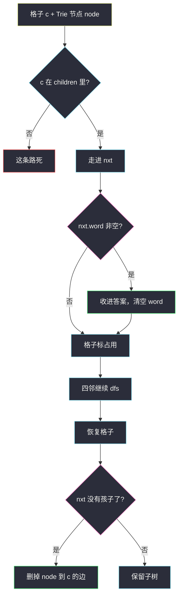
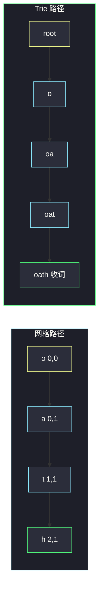

# 单词搜索 II（棋盘 DFS + 字典树剪枝）

## 一、问题描述

给定 `m × n` 字符网格 `board` 和单词列表 `words`，返回**网格里出现过的**所有单词。

单词必须由相邻单元格（上下左右，不能斜）的字母组成，同一个单元格在**一个单词**里不能用两次。不同单词之间网格复用。`words` 中可能有的词在网格里不存在，不要输出。

> 🔗 LeetCode 212：https://leetcode.cn/problems/word-search-ii/
>
> 数据范围：`m, n ≤ 12`，`1 <= words.length <= 3·10^4`，`1 <= words[i].length <= 10`。格子与单词只含小写字母。
>
> 📚 灵茶题单：**字典树 · §6.2 进阶**。单单词版是 [79. 单词搜索](https://leetcode.cn/problems/word-search/)；词一多，就不能每个词单独 DFS 一遍网格。

**示例 1**

```
输入：
board = [["o","a","a","n"],
         ["e","t","a","e"],
         ["i","h","k","r"],
         ["i","f","l","v"]]
words = ["oath","pea","eat","rain"]
输出：["eat","oath"]
```

**示例 2**

```
输入：board = [["a","b"],["c","d"]], words = ["abcb"]
输出：[]
解释：4 个格子走完也拼不出，且同一格不能用两次。
```

**直观理解**

79 题是「这一个词能不能在网格里走出来」。现在有最多三万个词，共同前缀很多（`app` / `apple` / `apply`）。把词典收成一棵 Trie，从每个格子出发，**沿着 Trie 有的边走网格**。走到标记「这里是一个完整词」的节点就收答案。Trie 没有的边，网格再往外走也白走——这就是剪枝。

---

## 二、暴力解法

对每个单词套 79：从每个格子 DFS，按该词的下一个字母走。

```python
class Solution:
    def findWords(self, board: List[List[str]], words: List[str]) -> List[str]:
        m, n = len(board), len(board[0])
        dirs = ((0, 1), (0, -1), (1, 0), (-1, 0))

        def exist(word: str) -> bool:
            def dfs(i, j, k):
                if k == len(word):
                    return True
                if not (0 <= i < m and 0 <= j < n) or board[i][j] != word[k]:
                    return False
                t, board[i][j] = board[i][j], "#"
                ok = any(dfs(i + di, j + dj, k + 1) for di, dj in dirs)
                board[i][j] = t
                return ok

            return any(
                dfs(i, j, 0) for i in range(m) for j in range(n)
            )

        return [w for w in words if exist(w)]
```

网格最大 `12×12`，单个词长 ≤ 10，79 能过；乘上 `3·10^4` 个词，公共前缀被反复走，会超时。

### 复杂度

- **时间**：约 `O(|words| · m · n · 4^L)`，`L ≤ 10`。
- **空间**：递归 `O(L)`。

### 🔴 瓶颈在哪里

每个词都从整张图的每个格子重启。`oath` 和 `oa`、`eat` 和 `eats` 共享的前缀路径被复制了成千上万次。应**先把词插进一棵树，网格只走一遍（每个起点一次 DFS），用树指针代替「当前匹配到第几个字母」**。

---

## 三、优化探索（核心章节）

> 📚 本题在灵茶题单中属于 **§6.2 进阶**：在网格上跑字典树，而不是给每个模式单独跑。

### 3.1 Trie 节点存什么

每个节点：

- `children`：最多 26 条边
- `word`：若该节点对应某个完整单词，把这个字符串存在这里（找不到则为空）。比单独 `is_word` 方便——搜到时直接把字符串放进答案，不必另外拼。

插入 `oath`、`pea`、`eat`、`rain` 后（示例 1）：

```
root
├─ o → a → t → h   (word = "oath")
├─ p → e → a       (word = "pea")
├─ e → a → t       (word = "eat")
└─ r → a → i → n   (word = "rain")
```

### 3.2 网格 DFS 怎么和 Trie 同步

从格子 `(i, j)`、Trie 节点 `node` 出发（一开始 `node` 是根，还没吃当前格子）：

1. 看 `board[i][j]` 有没有 `node.children[c]`。没有就返回。
2. 走进子节点 `nxt`。若 `nxt.word` 非空，收录，然后**把 `nxt.word` 清空**——同一词可能从不同路径再次走到，只输出一次。
3. 把 `board[i][j]` 改成 `'#'`（本词路径上占用），对上下左右继续 `dfs(邻格, nxt)`。
4. 回溯：格子改回 `c`。

当前格子对应的是「即将要走的那条边」，所以进入函数先查边，再下钻。不要先走进去再查——根节点没有字母。



### 3.3 两处关键优化

**去重**：`nxt.word = None`。否则从另一起点再走出同一个词会重复加入。题目要的是单词集合，不是路径条数。

**删边剪枝**：回溯后若 `nxt.children` 已空（叶子词已被收走，或子树全部删光），执行 `del node.children[c]`。后面从别的格子再走到 `node` 时，这条死枝不会再下钻。词很多、网格很小的时候，越搜树越瘦，这是 §6.2 能过 `3·10^4` 词的关键。

注意删的是**父节点上的边**，而且要在四邻 DFS **全部结束**之后——子树可能还要给当前路径上更长的词用。

### 3.4 同一格不能用两次

`'#'` 标记只作用于**当前这一次 DFS 的路径**。回溯必须恢复，否则第二个单词看不到这些格子。这和 79 完全一样。

### 3.5 一句话核心

> **词典建成 Trie；每个格子当起点，沿树有的边在网格上走。走到单词节点就收答案并清空；子树空了就把边删掉。**

---

## 四、代码实现

### Python（主解：Trie + DFS + 删边）

```python
class TrieNode:
    def __init__(self):
        self.children = {}
        self.word = None


class Solution:
    def findWords(self, board: List[List[str]], words: List[str]) -> List[str]:
        root = TrieNode()
        for w in words:
            node = root
            for ch in w:
                node = node.children.setdefault(ch, TrieNode())
            node.word = w

        m, n = len(board), len(board[0])
        ans = []
        dirs = ((1, 0), (-1, 0), (0, 1), (0, -1))

        def dfs(i: int, j: int, node: TrieNode) -> None:
            c = board[i][j]
            if c not in node.children:
                return
            nxt = node.children[c]
            if nxt.word is not None:
                ans.append(nxt.word)
                nxt.word = None
            board[i][j] = "#"
            for di, dj in dirs:
                ni, nj = i + di, j + dj
                if 0 <= ni < m and 0 <= nj < n and board[ni][nj] != "#":
                    dfs(ni, nj, nxt)
            board[i][j] = c
            if not nxt.children:
                del node.children[c]

        for i in range(m):
            for j in range(n):
                dfs(i, j, root)
        return ans
```

**变量含义**

| 变量 | 含义 |
|------|------|
| `node` | 已经匹配的前缀所在 Trie 节点（不含当前格） |
| `nxt` | 吃掉当前格字母之后的节点 |
| `nxt.word` | 以该节点结尾的完整单词；收过就清空 |
| `'#'` | 当前路径占用的格子 |

### Java（最优解同款）

```java
class Solution {
    static class TrieNode {
        TrieNode[] children = new TrieNode[26];
        String word;
    }

    public List<String> findWords(char[][] board, String[] words) {
        TrieNode root = new TrieNode();
        for (String w : words) {
            TrieNode node = root;
            for (int k = 0; k < w.length(); k++) {
                int idx = w.charAt(k) - 'a';
                if (node.children[idx] == null) {
                    node.children[idx] = new TrieNode();
                }
                node = node.children[idx];
            }
            node.word = w;
        }
        List<String> ans = new ArrayList<>();
        int m = board.length, n = board[0].length;
        for (int i = 0; i < m; i++) {
            for (int j = 0; j < n; j++) {
                dfs(board, i, j, root, ans);
            }
        }
        return ans;
    }

    private void dfs(char[][] board, int i, int j, TrieNode node, List<String> ans) {
        char c = board[i][j];
        if (c == '#' || node.children[c - 'a'] == null) {
            return;
        }
        TrieNode nxt = node.children[c - 'a'];
        if (nxt.word != null) {
            ans.add(nxt.word);
            nxt.word = null;
        }
        board[i][j] = '#';
        int[][] dirs = {{1, 0}, {-1, 0}, {0, 1}, {0, -1}};
        for (int[] d : dirs) {
            int ni = i + d[0], nj = j + d[1];
            if (ni >= 0 && ni < board.length && nj >= 0 && nj < board[0].length) {
                dfs(board, ni, nj, nxt, ans);
            }
        }
        board[i][j] = c;
        boolean empty = true;
        for (TrieNode ch : nxt.children) {
            if (ch != null) {
                empty = false;
                break;
            }
        }
        if (empty) {
            node.children[c - 'a'] = null;
        }
    }
}
```

Java 没有 `del`，把对应儿子置 `null` 即可。判断子树空要扫 26 格；也可以在节点上维护 `childCount`，收词、删边时加减。

---

## 五、具体例子演示

用示例 1 的网格，但逐步只跟踪两条成功路径，并看 Trie 指针。

```
  0 1 2 3
0 o a a n
1 e t a e
2 i h k r
3 i f l v
```

### 5.1 走出 `"oath"`：从 `(0,0)` 出发

起点 `(0,0)='o'`，`node = root`。

| 步 | 格子 | 当前 node | `c` 有边？ | 走进 nxt 后 | 收词？ | 占用 |
|----|------|-----------|------------|-------------|--------|------|
| 1 | (0,0) | root | `o` 有 | o | 否 | o 标 # |
| 2 | (0,1) | o | `a` 有 | o-a | 否 | a 标 # |
| 3 | (1,1) | o-a | `t` 有 | o-a-t | 否 | t 标 # |
| 4 | (2,1) | o-a-t | `h` 有 | o-a-t-h | **word=oath**，清空 | h 标 # |

第 4 步四邻是 `i, k, t(#), f`，Trie 在 `h` 已是叶子，没有孩子，回溯后 `del` 掉 `t → h`。若词典里没有更长的 `oathx`，这条枝会逐步变瘦。

从 `(0,0)` 的 `o` 还能往下走 `(1,0)='e'`，但根的 `o` 下面没有 `e` 边，第 1 步的四邻里这条立刻死。



### 5.2 走出 `"eat"`：必须从右边那只 `e` 起

左边 `(1,0)='e'` 的邻居是 `o, t, i`，没有 `a`。Trie 在 `e` 下面只要 `a`（单词 `eat`），所以从左边 `e` 出发走一步就死。

右边 `(1,3)='e'`：

| 步 | 格子 | Trie | 说明 |
|----|------|------|------|
| 1 | (1,3) e | root → e | 占用 e |
| 2 | (1,2) a | e → ea | 左邻是 a，命中 |
| 3 | (1,1) t | ea → eat | 再左是 t，**收 "eat"** |

`pea` 要从 `p` 起，网格里没有 `p`。`rain` 要从 `r` 起，`(2,3)='r'` 的邻居是 `e, k, v`，没有 `a`，走不通。最终答案 `["oath","eat"]`（顺序取决于起点扫描次序，题目允许任意序）。

### 5.3 小网格逐步走 Trie（去重 + 删边）

`board = [["a","a"],["a","a"]]`，`words = ["a","aa"]`。

Trie：`root - a (word="a") - a (word="aa")`。

从 `(0,0)` 出发：

1. 吃第一格 `a`，走到节点 A1，发现 `word="a"`，收录并把 A1.word 清空。A1 仍有孩子，不能删边。
2. 再走相邻另一个 `a`，走到节点 A2，收录 `"aa"`，清空。A2 无孩子，**删除 A1 → 第二个 a 的边**。
3. 回溯到 A1 时 `children` 已空，再删除 `root → a`。

之后 `(0,1)`、`(1,0)`、`(1,1)` 再当起点：根上已经没有 `a` 边，全部立刻返回。若不去重，`"a"` 会被收 4 次；若不删边，每个起点仍会把整棵树走完。两种优化都要命中。

---

## 六、复杂度分析

设网格 `m×n`，词数 `W`，最长词长 `L ≤ 10`，词典总字符 `S`。

| 方法 | 时间 | 空间 | 说明 |
|------|------|------|------|
| 每词单独 79 | `O(W · m · n · 4^L)` | `O(L)` | `W = 3·10^4` 超时 |
| Trie + DFS（主解） | 建树 `O(S)`；搜索每个起点一条深度 ≤ `L` 的 4 叉路径，删边后越来越瘦 | Trie `O(S)` + 递归 `O(L)` | 最坏仍可到 `m·n·4^L`，但共享前缀 + 删边远小于按词乘 |
| 答案 | 另计 `O(找到的词数 · L)` | | 去重后每词最多一次 |

---

## 七、对比总结

| 维度 | 每词 DFS | Trie 一次走网格 |
|------|----------|-----------------|
| 公共前缀 | 重复走 | 树上共享 |
| 失败词 | 每个都扫满网格 | 根上没边的首字母，对应格子一步不走（如 `pea`） |
| 重复答案 | 要额外 set | 清空 `word` |
| 越搜越快 | 否 | 叶子删边 |

**易错点**

1. **同一路径重复用格**：忘记 `'#'` 或回溯时不恢复，后一个词缺字母。
2. **斜对角**：题目只允许四方向。
3. **重复加入同一单词**：不清空 `word`，从四个 `a` 出发会得到四份 `"a"`。
4. **过早删边**：在四邻还没搜完时就把叶子删了，更长的词走不到。先 DFS 完再 `if not nxt.children: del`。
5. **从根把当前字母当「已匹配前缀」**：进入 `dfs` 时应先用当前格去 `node.children` 里查，根不含字母。
6. **`words` 里有的词是另一个词的前缀**：节点上同时有 `word` 和 `children`，收完短词**不要**删节点，只清空 `word`。`"a"` / `"aa"` 那例就是。

**模板（§6.2 网格 + Trie）**

```python
nxt = node.children[c]
if nxt.word: 收集并清空
# 占用格子，四邻 dfs(邻, nxt)，恢复
if not nxt.children: del node.children[c]
```

---

## 八、举一反三

| 题目 | 关系 |
|------|------|
| [79. 单词搜索](https://leetcode.cn/problems/word-search/) | 单模式版，不必建 Trie |
| [208. 实现 Trie](https://leetcode.cn/problems/implement-trie-prefix-tree/) | 本题节点结构的来源 |
| [140. 单词拆分 II](https://leetcode.cn/problems/word-break-ii/) | §6.3：字符串上一维沿 Trie 切词，见 `word-break-ii.md` |
| [211. 添加与搜索单词](https://leetcode.cn/problems/design-add-and-search-words-data-structure/) | Trie + 通配符 DFS |
| [677. 键值映射](https://leetcode.cn/problems/map-sum-pairs/) | Trie 上维护子树和 |

**思想迁移**

- 见到「很多模式 + 二维相邻」，先把模式收成 Trie，在图 / 网格上用树指针当状态，失败边立刻停；搜到的模式从树上摘掉，避免重复和死枝。
- 口诀：**「词先插进 Trie，格子沿边走；收词就摘牌，空子树砍边。」**
