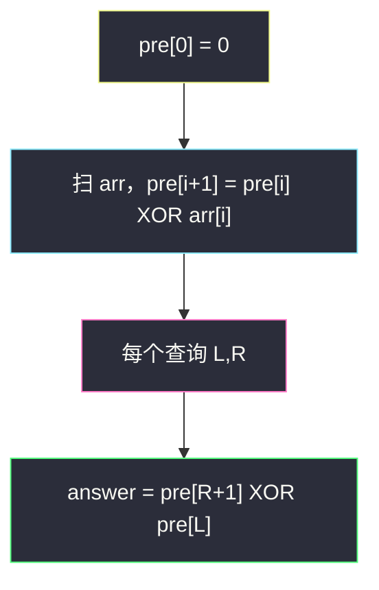
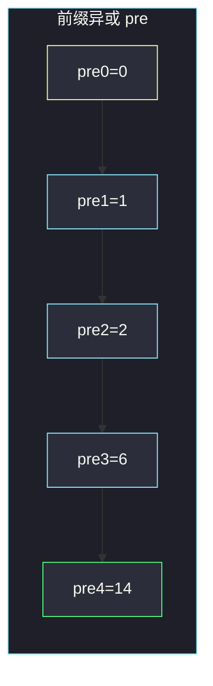

# 子数组异或查询（前缀异或）

## 一、问题描述

给你一个整数数组 `arr`，以及若干查询 `queries`。第 `i` 个查询 `queries[i] = [Li, Ri]`，要求计算子数组 `arr[Li], arr[Li+1], …, arr[Ri]` 的**按位异或**结果。

返回数组 `answer`，其中 `answer[i]` 是第 `i` 个查询的答案。

> 🔗 LeetCode 1310：https://leetcode.cn/problems/xor-queries-of-a-subarray/
>
> 数据范围：`1 <= arr.length, queries.length <= 3 * 10^4`，`0 <= arr[i] <= 10^9`，`0 <= Li <= Ri < arr.length`。

**示例 1**

```
输入：arr = [1,3,4,8], queries = [[0,1],[1,2],[0,3],[3,3]]
输出：[2,7,14,8]
解释：
[0,1] → 1 XOR 3 = 2
[1,2] → 3 XOR 4 = 7
[0,3] → 1 XOR 3 XOR 4 XOR 8 = 14
[3,3] → 8
```

**示例 2**

```
输入：arr = [4,8,2,10], queries = [[2,3],[1,3],[0,0],[0,3]]
输出：[8,0,4,4]
```

**直观理解**

一次区间异或若从 `Li` 扫到 `Ri`，单次 `O(n)`，查询多达 `3·10^4` 会超时。加法有前缀和；异或同样满足结合律，而且「自己异或自己 = 0」，于是区间异或也能用两个前缀值在 `O(1)` 取出。

---

## 二、暴力解法

每个查询独立从左端累异或到右端：

```python
class Solution:
    def xorQueries(self, arr: List[int], queries: List[List[int]]) -> List[int]:
        ans = []
        for L, R in queries:
            x = 0
            for i in range(L, R + 1):
                x ^= arr[i]
            ans.append(x)
        return ans
```

### 复杂度

- **时间**：`O(n · q)`。`n`、`q` 都到 `3·10^4`，约 `10^9` 量级，超时。
- **空间**：`O(1)` 额外（不计答案数组）。

### 🔴 瓶颈在哪里

同一段被很多查询反复扫。若预先把「从开头到每一位」的异或存下来，任意 `[L, R]` 就变成两次查表。

---

## 三、优化探索（核心章节）

> 📚 本题在灵茶题单中属于 **前缀和 · §1.1 基础**。模板和区间和完全同构：加法前缀用减法还原区间，异或前缀用再异或一次还原区间。

### 3.1 异或的两条性质

- `x ^ x = 0`，`x ^ 0 = x`
- 结合、交换：一串数的异或与运算顺序无关

因此：

```
(arr[0] ^ … ^ arr[R])  ^  (arr[0] ^ … ^ arr[L-1])
= arr[L] ^ arr[L+1] ^ … ^ arr[R]
```

左边前半段被「异或两次」消掉，正好留下区间。

### 3.2 前缀异或数组

约定 `pre[0] = 0`（空前缀），`pre[i+1] = pre[i] ^ arr[i]`。于是 `pre[i]` 表示 `arr[0] ^ … ^ arr[i-1]`（共 `i` 个数）。

查询 `[L, R]`（闭区间、0-based）：

```
answer = pre[R+1] ^ pre[L]
```

- `pre[R+1]`：到 `arr[R]` 为止
- `pre[L]`：到 `arr[L-1]` 为止（`L = 0` 时是 0，整段从开头开始）

这和区间和 `pre[R+1] - pre[L]` 是同一张图，只是「减」换成「异或」。



### 3.3 下标别混

`arr` 长度 `n`，`pre` 长度 `n+1`。查询给的是**元素下标** `L, R`，不是 `pre` 的下标。写成 `pre[R] ^ pre[L-1]` 时要特判 `L = 0`，所以用 `pre[R+1] ^ pre[L]` 更干净。

### 3.4 一句话核心

> **先建 `pre[0]=0`、`pre[i+1]=pre[i]^arr[i]`；区间 `[L,R]` 的异或就是 `pre[R+1]^pre[L]`。**

---

## 四、代码实现

### Python（主解）

```python
class Solution:
    def xorQueries(self, arr: List[int], queries: List[List[int]]) -> List[int]:
        n = len(arr)
        pre = [0] * (n + 1)
        for i, x in enumerate(arr):
            pre[i + 1] = pre[i] ^ x
        return [pre[R + 1] ^ pre[L] for L, R in queries]
```

**变量含义**

| 变量 | 含义 |
|------|------|
| `pre[i]` | `arr[0] ^ … ^ arr[i-1]`；`pre[0] = 0` |
| `L, R` | 查询闭区间在 `arr` 上的下标 |

### Java（最优解同款）

```java
class Solution {
    public int[] xorQueries(int[] arr, int[][] queries) {
        int n = arr.length;
        int[] pre = new int[n + 1];
        for (int i = 0; i < n; i++) {
            pre[i + 1] = pre[i] ^ arr[i];
        }
        int[] ans = new int[queries.length];
        for (int i = 0; i < queries.length; i++) {
            int L = queries[i][0], R = queries[i][1];
            ans[i] = pre[R + 1] ^ pre[L];
        }
        return ans;
    }
}
```

---

## 五、具体例子演示

### 5.1 建前缀：`arr = [1, 3, 4, 8]`

| 步 | 处理 | 公式 | pre（更新后） |
|----|------|------|---------------|
| 初 | — | `pre[0] = 0` | `[0]` |
| i=0 | `arr[0]=1` | `0 ^ 1 = 1` | `[0, 1]` |
| i=1 | `arr[1]=3` | `1 ^ 3 = 2` | `[0, 1, 2]` |
| i=2 | `arr[2]=4` | `2 ^ 4 = 6` | `[0, 1, 2, 6]` |
| i=3 | `arr[3]=8` | `6 ^ 8 = 14` | `[0, 1, 2, 6, 14]` |

二进制核对：`1=0001`，`3=0011` → `0010=2`；再 `^ 4=0100` → `0110=6`；再 `^ 8=1000` → `1110=14`。



### 5.2 四个查询

| 查询 `[L,R]` | 公式 | 计算 | 对应子数组 |
|--------------|------|------|------------|
| `[0,1]` | `pre[2] ^ pre[0]` | `2 ^ 0 = 2` | `1^3` |
| `[1,2]` | `pre[3] ^ pre[1]` | `6 ^ 1 = 7` | `3^4` |
| `[0,3]` | `pre[4] ^ pre[0]` | `14 ^ 0 = 14` | 整段 |
| `[3,3]` | `pre[4] ^ pre[3]` | `14 ^ 6 = 8` | 单点 `8` |

单点查询 `pre[i+1] ^ pre[i] = arr[i]`，可当作自检：前缀相邻两项再异或，应还原原数组。

示例 2：`arr = [4,8,2,10]`，`pre = [0, 4, 12, 14, 4]`。

| 查询 | 公式 | 结果 |
|------|------|------|
| `[2,3]` | `4 ^ 12 = 8` | `2^10=8` |
| `[1,3]` | `4 ^ 4 = 0` | `8^2^10=0` |
| `[0,0]` | `4 ^ 0 = 4` | `4` |
| `[0,3]` | `4 ^ 0 = 4` | 整段 |

---

## 六、复杂度分析

| 方法 | 时间 | 空间 | 说明 |
|------|------|------|------|
| 逐查询扫描 | `O(n · q)` | `O(1)` | n=q=3e4 超时 |
| 前缀异或（主解） | `O(n + q)` | `O(n)` | 建表 `O(n)`，每次查询 `O(1)` |

`pre` 多一个哨兵 0，空间仍是线性。答案数组不算额外复杂度时，也可说查询阶段 `O(1)` 额外空间（原地写 `answer`）。

---

## 七、对比总结

| 维度 | 暴力 | 前缀异或 |
|------|------|----------|
| 区间怎么拿 | 现场累 `^` | 两个前缀再 `^` |
| 和前缀和的差别 | — | 还原运算从「减」换成「异或」 |
| 空前缀 | 无 | `pre[0]=0` 让 `L=0` 不必特判 |

**易错点**

1. **写成 `pre[R] ^ pre[L]`**：少了一格，区间右端没包含 `arr[R]`。
2. **`pre` 与 `arr` 共用下标且忘了空前缀**：`L=0` 时 `pre[L-1]` 越界。
3. **用加减还原异或**：异或没有「减」，还原只能再异或。
4. **把查询下标当成 1-based**：题面是 0-based。
5. **原地改 `arr` 当前缀**：若后面还要用原数组会乱；本题可以，但单独开 `pre` 更不易错。

**模板（§1.1 前缀异或）**

```python
pre = [0] * (n + 1)
for i, x in enumerate(arr):
    pre[i + 1] = pre[i] ^ x
# 闭区间 [L, R]
x = pre[R + 1] ^ pre[L]
```

---

## 八、举一反三

| 题目 | 关系 |
|------|------|
| [1480. 一维数组的动态和](https://leetcode.cn/problems/running-sum-of-1d-array/) | 加法版前缀；本题把 `+`/`-` 换成 `^` |
| [1314. 矩阵区域和](https://leetcode.cn/problems/matrix-block-sum/) | 同属前缀家族：二维加法 + 容斥；本题是一维异或 |
| [2433. 找出前缀异或的原始数组](https://leetcode.cn/problems/find-the-original-array-of-prefix-xor/) | 已知 `pre`，用 `pre[i] ^ pre[i-1]` 还原 `arr[i]` |
| [1734. 解码异或后的排列](https://leetcode.cn/problems/decode-xored-permutation/) | 前缀异或 + 1..n 的总异或求出 `perm[0]` |
| [1442. 形成两个异或相等数组的三元组数目](https://leetcode.cn/problems/count-triplets-that-can-form-two-arrays-of-equal-xor/) | 区间异或为 0 ⇔ `pre[j+1]==pre[i]` |
| [1371. 每个元音包含偶数次的最长子字符串](https://leetcode.cn/problems/find-the-longest-substring-containing-vowels-in-even-counts/) | 前缀异或压状态，哈希找最早同状态 |

**思想迁移**

- 满足结合律、且存在「逆运算」的运算（加/减、异或）都能做前缀。
- 口诀：**「空前缀放 0；区间 XOR = 右前缀再 XOR 左前缀。」**
